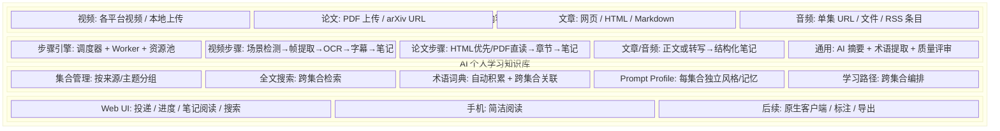

# 00 · 项目愿景

> 项目**为什么存在**，以及**不做什么**。做决策时用它来回答"这事该不该做"。

## 一句话

AI 辅助的个人学习知识库——把视频、论文、文章等学习材料，自动转化为结构化笔记，积累为可检索、可关联的个人知识体系。

## 1. 目标

### 1.1 功能目标（做什么）

- **多来源内容摄入**：视频、论文、文章、音频四类内容；可创建来源以 `configs/sources.yaml` 为准
- **自动分析生成笔记**：按内容类型提取原始材料，再由 AI 生成结构化笔记
- **个人知识库**：按来源/主题分集合，跨集合搜索、问答，积累术语和概念关联
- **手机投递+阅读**：粘贴 URL 或上传文件，在响应式 Web UI 阅读笔记
- **AI 辅助学习**：术语解释、概念关联、跨源问答和手工建卡 SRS

### 1.2 工程目标（怎么做）

- **可扩展**：新增内容类型（论文/文章）只需写适配器+步骤，不改框架
- **自托管**：Docker 部署，不依赖第三方平台，数据完全自有
- **低成本**：Claude 订阅 + 现有硬件 + 可选云服务器
- **AI 主力开发**：Claude 作为主力协作者，人做架构和验收
- **渐进式**：先做视频，验证通了再加论文/文章，不一步到位

### 1.3 非功能目标

- 笔记质量 ≥ 4/5（AI 评审）
- 手机投递到笔记可读 < 30 分钟（短视频）
- 知识库搜索 < 1 秒
- 宿主机零污染（全 Docker）

## 2. 非目标（明确不做）

| 非目标 | 原因 |
|--------|------|
| 多用户/社交 | 个人工具，不对外 |
| 实时转写/直播分析 | 离线处理已足够 |
| 笔记编辑器 | 只做标注，不做 Notion/Obsidian |
| 自动实体关系图谱 | 当前只有术语 / 主题 / occurrence 驱动的概念图首版，不把自动关系推理包装成已实现 |
| 移动端原生 App | 当前使用响应式 Web UI；原生 iOS / Mac App 尚未开始，PWA 与通知也尚未实现 |
| 多语言界面 | 中文为主，英文内容用中文笔记 |

### 当前成熟度口径

| 状态 | 能力 |
|------|------|
| 完整 | 来源 registry、OpenAPI 枚举、API 入队前 fail-closed 与前端来源目录同源 |
| first-pass | 四类摄入、FTS5 Search / Ask / MCP、集合订阅、概念图、评审、手工建卡 SRS、知识雷达、远程 Worker 网关 |
| 未开始 | 原生客户端、通知 / PWA、自动分类、知识缺口与矛盾检测、证据型自动卡片 |

`first-pass` 表示功能可用但真实集成、可靠性或质量门尚未闭环，不等于“全部完成”。向量检索也不是
预设完成项：只有检索黄金集证明 FTS5 未达阈值时才启动。具体证据和优先级以
[ROADMAP.md](../ROADMAP.md) 为准。

## 3. 用户画面

### 场景一：手机刷到好视频
> 在视频网站看到一个讲解视频 → 复制 URL → 打开知识库网页粘贴投递 → 稍后回到任务列表查看进度 → 打开生成的关键截图与结构化笔记

### 场景二：系统学习某个主题
> 想学某个技术 → 创建集合或订阅支持的来源 → 逐步入库内容 → 按集合阅读结构化笔记 → 遇到术语时回到概念页查看跨来源定义

### 场景三：电脑深度学习
> 打开某个笔记 → 查看原始材料、截图与智能笔记 → 搜索“这个概念在其他内容里怎么讲的” → 跨集合找到关联内容；分屏回放和标注仍是后续体验目标

### 场景四：阅读论文
> 拖拽 PDF 上传或投递 arXiv URL → arXiv HTML 优先、PDF 直接阅读兜底 → 生成章节化中文笔记 → 关联已有内容中的概念

## 4. 系统边界

