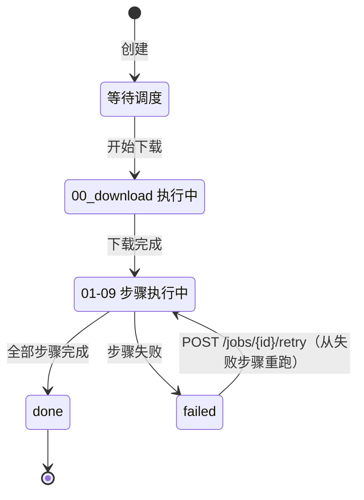
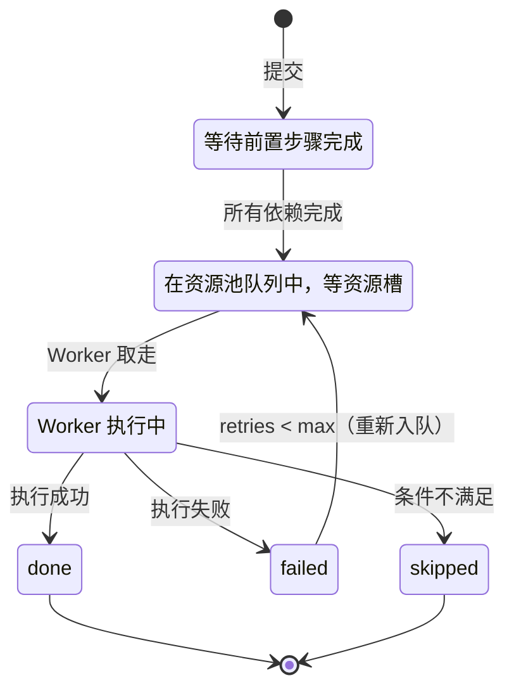

# 02 · 领域模型

> 核心实体、状态机、数据库表结构、文件存储布局。

## 1. 核心实体

### Collection（集合）

集合 = 用户心中的一个学习主题，**不绑定来源或内容类型**。同一集合可以包含 B站视频 + YouTube 视频 + 论文 + 文章。

```python
@dataclass
class Collection:
    id: str                        # "llm-learning"
    name: str                      # "LLM 学习"
    domain: str                    # "ml" → 继承该 domain 的 Profile
    description: str               # "从 Attention 到 RLHF 的系统学习"
    tags: list[str]                # ["transformer", "fine-tuning", "rag"]
    job_count: int                 # 包含的 Job 数（跨内容类型）
    created_at: datetime
    updated_at: datetime
```

示例：
```
Collection "LLM 学习" (domain: ml)
  ├── Job: 某论文精读视频 (video, bilibili)
  ├── Job: 某可视化讲解视频 (video, youtube)
  ├── Job: Attention Is All You Need (paper, arxiv)
  └── Job: 某技术博客文章 (article, web)

Collection "模型架构案例" (domain: deep-learning)
  ├── Job: 某模型架构讲解系列 (video, bilibili)
  ├── Job: 某技术评测文章 (article, web)
  └── Job: 某方法论文 (paper, pdf)
```

同一 domain 下可以有多个 Collection。Collection 之间通过 domain 共享术语和 Profile。

### Job（任务）

```python
@dataclass
class Job:
    id: str                        # "j_20260516_abc123"
    content_type: str              # "video" | "paper" | "article"
    pipeline: str                  # 步骤链名称 → pipelines.yaml
    collection_id: str | None      # 所属集合
    url: str | None                # 原始 URL
    title: str | None              # 内容标题 (下载后填充)
    domain: str                    # "deep-learning" | "ml" | "general" | ...
    source: str                    # "bilibili" | "youtube" | "arxiv" | "upload" | ...
    style_tags: list[str]          # ["lecture", "code-tutorial"] → 06-prompt-engineering
    status: JobStatus
    current_step: str | None       # 派生字段（查 job_steps 中 status=running），不存 DB
    progress_pct: int              # 缓存字段，调度器更新步骤状态时同步写入 DB（避免查询时 JOIN 计算）
    meta: dict                     # 内容类型特有元数据
    created_at: datetime           #   video: {"duration_sec": 485}
    updated_at: datetime           #   paper: {"pages": 12, "authors": [...]}
    error: str | None              #   article: {"word_count": 3000}
```

`content_type` 决定使用哪条步骤链（pipeline），`meta` 存放内容类型特有的字段（视频时长、论文页数等），避免在 Job 上堆积各类型字段。

### Step（步骤执行记录）

```python
@dataclass
class Step:
    job_id: str
    name: str                      # "01_scene"
    status: StepStatus
    pool: str                      # "scene" | "cpu" | "ai" | "io" | "gpu"
    input_hash: str | None         # 幂等指纹
    worker_id: str | None          # 执行此步骤的 Worker
    started_at: datetime | None
    finished_at: datetime | None
    duration_sec: float | None
    meta: dict                     # {"scenes": 76, "kept": 50, ...}
    error: str | None
    retries: int                   # 已重试次数
```

### Worker（Worker 注册信息）

Worker 信息存两份：Redis（实时心跳）+ SQLite（持久记录）。

```python
@dataclass
class Worker:
    id: str                        # "ai-a1b2c3d4"
    type: str                      # "download" | "cpu" | "gpu" | "ai"
    pools: list[str]               # 消费的池列表
    status: str                    # "idle" | "busy" | "draining" | "offline"
    current_job: str | None
    current_step: str | None
    hostname: str | None           # 机器名/IP，方便识别
    gpu_name: str | None           # "RTX 4090" (GPU Worker)
    gpu_memory_mb: int | None
    capabilities: list[str]        # ["whisper", "ocr", "scene"]
    # 统计
    tasks_completed: int           # 累计完成任务数
    tasks_failed: int              # 累计失败任务数
    total_duration_sec: float      # 累计执行时长
    # 时间
    first_seen: datetime           # 首次注册时间
    started_at: datetime           # 本次启动时间
    last_heartbeat: datetime
```

### Term（术语）— M2

```python
@dataclass
class Term:
    term: str                      # "注意力"
    definition: str                # "通过 Query/Key/Value 计算序列内元素的相关性权重"
    domain: str                    # "deep-learning"
    sources: list[str]             # ["my-dl/BV1example001", ...]
    related: list[str]             # ["Transformer", "微调"]
    created_at: datetime
```

## 2. 状态机

### Job 生命周期



### Step 生命周期



### Step 跳过条件

| 步骤 | 跳过条件 |
|------|---------|
| 00b_whisper | input/ 下已有 .srt 文件 |
| 05_danmaku | input/ 下无 .ass 文件 |
| 06_punctuate | input/ 下无 .srt 文件 |

跳过的步骤标记为 `skipped`，不阻塞后续步骤。

## 3. 数据库表结构

SQLite，直接写 SQL，不用 ORM。

```sql
-- 任务
CREATE TABLE jobs (
    id TEXT PRIMARY KEY,
    content_type TEXT NOT NULL,           -- video/paper/article
    pipeline TEXT NOT NULL,               -- 步骤链名称
    collection_id TEXT,
    url TEXT,
    title TEXT,
    domain TEXT NOT NULL DEFAULT 'general',
    source TEXT,                          -- bilibili/youtube/arxiv/upload/...
    style_tags TEXT DEFAULT '[]',         -- JSON array, 风格标签
    status TEXT NOT NULL DEFAULT 'pending',
    progress_pct INTEGER DEFAULT 0,
    meta TEXT DEFAULT '{}',              -- JSON, 内容类型特有元数据
    created_at TEXT NOT NULL,
    updated_at TEXT NOT NULL,
    error TEXT
);

CREATE INDEX idx_jobs_status ON jobs(status);
CREATE INDEX idx_jobs_collection ON jobs(collection_id);

-- Worker 持久记录（配合 Redis 实时心跳使用）
CREATE TABLE workers (
    id TEXT PRIMARY KEY,
    type TEXT NOT NULL,                   -- download/cpu/gpu/ai
    pools TEXT NOT NULL,                  -- JSON array
    hostname TEXT,
    gpu_name TEXT,
    gpu_memory_mb INTEGER,
    capabilities TEXT DEFAULT '[]',       -- JSON array
    tags TEXT NOT NULL DEFAULT '[]',       -- JSON array, 能力标签 ["vision","gpu"]
    reject_tags TEXT NOT NULL DEFAULT '[]', -- JSON array, 排斥标签 ["private"]
    status TEXT NOT NULL DEFAULT 'offline',  -- idle/busy/draining/offline
    current_job TEXT,
    current_step TEXT,
    tasks_completed INTEGER DEFAULT 0,
    tasks_failed INTEGER DEFAULT 0,
    total_duration_sec REAL DEFAULT 0,
    first_seen TEXT NOT NULL,
    started_at TEXT,
    last_heartbeat TEXT,
    admin_note TEXT                        -- 运维备注（如"NAT 内网 GPU 机器"）
);

-- 步骤执行记录
CREATE TABLE job_steps (
    job_id TEXT NOT NULL REFERENCES jobs(id),
    step TEXT NOT NULL,
    status TEXT NOT NULL DEFAULT 'waiting',
    pool TEXT NOT NULL,
    input_hash TEXT,
    worker_id TEXT,
    started_at TEXT,
    finished_at TEXT,
    duration_sec REAL,
    meta TEXT,                            -- JSON
    error TEXT,
    retries INTEGER DEFAULT 0,
    PRIMARY KEY (job_id, step)
);

-- 标注 (M3)
CREATE TABLE annotations (
    id INTEGER PRIMARY KEY AUTOINCREMENT,
    job_id TEXT NOT NULL REFERENCES jobs(id),
    type TEXT NOT NULL,                   -- highlight/note/bookmark
    position_sec REAL,
    end_sec REAL,
    text TEXT,
    color TEXT,
    created_at TEXT NOT NULL
);

-- 集合（学习主题，不绑定来源/内容类型）
CREATE TABLE collections (
    id TEXT PRIMARY KEY,
    name TEXT NOT NULL,
    domain TEXT NOT NULL,                 -- → 继承 domain Profile
    description TEXT DEFAULT '',
    tags TEXT DEFAULT '[]',               -- JSON array
    job_count INTEGER DEFAULT 0,
    created_at TEXT NOT NULL,
    updated_at TEXT NOT NULL
);

-- 术语词典 (M2)
CREATE TABLE glossary (
    term TEXT PRIMARY KEY,
    definition TEXT NOT NULL,
    domain TEXT NOT NULL,
    sources TEXT DEFAULT '[]',            -- JSON array
    related TEXT DEFAULT '[]',            -- JSON array
    created_at TEXT NOT NULL
);

-- AI 调用记录（成本追踪，exec_id 去重防重复计费）
CREATE TABLE ai_usage (
    id INTEGER PRIMARY KEY AUTOINCREMENT,
    exec_id TEXT NOT NULL UNIQUE,        -- 执行唯一 ID，防重复写入
    job_id TEXT,
    step TEXT,
    provider TEXT NOT NULL,              -- anthropic/openai/deepseek/local
    model TEXT NOT NULL,
    input_tokens INTEGER,
    output_tokens INTEGER,
    cost_usd REAL,
    duration_sec REAL,
    cached INTEGER DEFAULT 0,
    created_at TEXT NOT NULL
);

CREATE INDEX idx_ai_usage_job ON ai_usage(job_id);
CREATE INDEX idx_ai_usage_provider ON ai_usage(provider);

-- 全文搜索索引 (M2)
CREATE VIRTUAL TABLE search_index USING fts5(
    job_id,
    collection_id,
    title,
    transcript,
    ocr_text,
    smart_notes,
    danmaku,
    content='',                           -- 外部内容模式
    tokenize='simple'                     -- 中文分词用 simple tokenizer
);
```

## 4. 文件存储布局

```
/data/
├── jobs/                                # 任务产物（核心数据）
│   └── {job_id}/
│       ├── job.json                     # 任务元信息（API 创建时写入）
│       ├── input/                       # 原始内容（下载步骤写入）
│       │   ├── metadata.json            # 标题/来源/类型特有信息
│       │   └── ...                      # 内容类型决定具体文件：
│       │       # video: source.mp4, subtitle.srt, danmaku.ass
│       │       # paper: source.pdf
│       │       # article: source.html
│       ├── intermediate/                # 中间产物（步骤间传递）
│       │   └── ...                      # 内容类型决定具体文件
│       ├── assets/                      # 关联资源（截图/图表等）
│       │   └── ...                      # video: scene_0000_1.5s.jpg, ...
│       │                                # paper: figure_1.png, ...
│       ├── output/                      # 最终产物（用户可见）
│       │   ├── notes_smart.md           # AI 结构化笔记（所有类型共有）
│       │   ├── review.json              # 质量评审（所有类型共有）
│       │   └── ...                      # 类型特有产物
│       │       # video: notes_mechanical.md, transcript.md
│       │       # paper: summary.md
│       └── logs/                        # 步骤执行日志
│           └── ...
│
├── cookies/                            # 平台凭证
│   ├── bilibili.txt                    # Netscape 格式
│   ├── youtube.txt                     # 手动上传
│   └── status.json                     # 各平台状态
│
├── configs/                            # 运行时配置
│   ├── pools.yaml                      # 资源池配置
│   ├── pipelines.yaml                  # 步骤链定义（按 content_type）
│   └── domain/                         # 领域配置
│       └── deep-learning.yaml
│
├── prompts/                            # Prompt 模板
│   ├── punctuate.md
│   ├── smart_notes.md
│   ├── review.md
│   ├── profiles/                       # 领域 Profile（按 domain）
│   │   ├── deep-learning.yaml
│   │   ├── ml.yaml
│   │   └── general.yaml
│   └── styles/                         # 风格标签（可组合）
│       ├── animated.yaml
│       ├── lecture.yaml
│       ├── code-tutorial.yaml
│       ├── talk.yaml
│       ├── case-study.yaml
│       └── math-visual.yaml
│
└── db/
    └── analyzer.db                     # SQLite 数据库
```

### Job 目录的 job.json

API 创建任务时写入，Worker 读取：

```json
{
  "id": "j_20260516_abc123",
  "content_type": "video",
  "pipeline": "video",
  "url": "https://www.bilibili.com/video/BV1example001",
  "source": "bilibili",
  "domain": "deep-learning",
  "collection_id": "my-dl",
  "created_at": "2026-05-16T20:00:00+08:00"
}
```

论文示例：
```json
{
  "id": "j_20260520_def456",
  "content_type": "paper",
  "pipeline": "paper",
  "url": "https://arxiv.org/abs/2301.00001",
  "source": "arxiv",
  "domain": "ml",
  "created_at": "2026-05-20T10:00:00+08:00"
}
```

## 5. 实体关系

```
Domain Profile 1 ←── N Collection（同 domain 共享 Profile/术语）
Collection     1 ──→ N Job（可包含不同 content_type 和 source）
Job            1 ──→ N Step
Job            1 ──→ N Annotation (M3)
Term           N ←──→ N Job（通过 sources 跨集合关联）
```

## 6. ID 生成规则

| 实体 | 格式 | 示例 |
|------|------|------|
| Job | `j_{date}_{random6}` | `j_20260516_a1b2c3` |
| Worker | `{type}-{random8}` | `ai-a1b2c3d4` |
| Collection | 用户自定义 slug | `my-dl` |
| Step | 固定名称 | `01_scene` |

Job ID 中包含日期方便按时间排序和人工识别。
