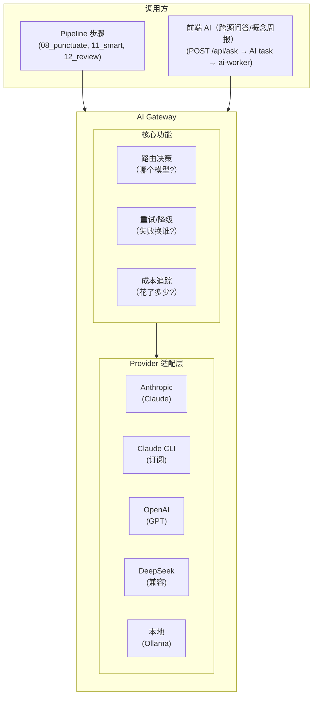

# AI 网关

> 统一的 LLM 调用层。Pipeline 步骤和前端交互都通过它访问 AI，支持多 Provider、多模型、路由、对比、降级。

## 1. 为什么需要网关

- 不同步骤对模型能力/成本要求不同（标点用廉价模型，笔记用强模型）
- 同一步骤想用多个 Provider 生成对比结果
- 前端需要交互式 AI（笔记问答）
- 统一管理 API key、配额、限流、成本追踪
- Provider 故障时自动降级到备选

## 2. 架构



## 3. Provider 适配

所有 Provider 统一为一个接口：

```python
class LLMProvider:
    async def complete(self, request: LLMRequest) -> LLMResponse:
        """统一调用接口"""
        ...

@dataclass
class LLMRequest:
    messages: list[dict]           # [{"role": "user", "content": ...}]
    model: str                     # "claude-sonnet-4-6" / "deepseek-v4-flash" / ...
    max_tokens: int
    temperature: float = 0.7
    images: list[Path] | None = None   # 多模态输入
    system: str | None = None
    response_format: str | None = None  # "json" | None

@dataclass
class LLMResponse:
    content: str
    model: str                     # 实际使用的模型
    provider: str                  # "anthropic" / "openai" / "deepseek" / "local"
    input_tokens: int
    output_tokens: int
    cost_usd: float                # 本次调用成本
    duration_sec: float
    cached: bool                   # prompt cache 命中
```

### 三种接入方式

| 方式 | 说明 | 成本模型 | 适合场景 |
|------|------|---------|---------|
| **API Key** | 直接调 Provider HTTP API | 按 token 计费 | 生产批量处理 |
| **CLI 订阅** | subprocess 调 `claude` CLI | 订阅月费内 | 轻量使用/开发阶段 |
| **本地模型** | 调本地 Ollama/vLLM | 免费（电费+硬件） | 简单任务/隐私敏感 |

CLI 订阅方式有额度限制，适合日处理量不大或开发调试阶段。超出额度后 Gateway 自动降级到 API Key 或其他 Provider。

### 已支持 Provider

**API Key 接入**：

| Provider | 协议 | 模型示例 | 特点 |
|----------|------|---------|------|
| Anthropic | 原生 SDK | claude-opus-4-8, claude-sonnet-4-6, claude-haiku-4-5 | 质量最高，支持 Batch/Caching |
| OpenAI | 原生 SDK | gpt-4o, gpt-4o-mini | 生态最大 |
| DeepSeek | OpenAI 兼容 | deepseek-v4-pro, deepseek-v4-flash | 极便宜，中文好 |
| Kimi | OpenAI 兼容 | moonshot-v1-8k/32k/128k | 中文好，多档上下文长度 |
| Qwen | OpenAI 兼容 | qwen3-72b, qwen3-7b | 中文强，有 API 也有本地版 |

**CLI 订阅接入**：

| Provider | CLI 命令 | 订阅计划 | 说明 |
|----------|---------|---------|------|
| Claude | `claude -p` | Pro/Max | 月度 Agent SDK Credit 内免费，超出按 API 价 |

CLI Provider 的实现是 subprocess 调用 + stdout 解析，与 API Provider 对调用方透明。prompt 走 stdin（无 ARG_MAX 限制），并强制 `--output-format json` 拿真实 usage 与成本：

```python
class ClaudeCLIProvider:
    async def complete(self, request: LLMRequest) -> LLMResponse:
        proc = await asyncio.create_subprocess_exec(
            "claude", "-p", "--output-format", "json", ...,
            stdin=asyncio.subprocess.PIPE, stdout=asyncio.subprocess.PIPE,
        )
        stdout, stderr = await proc.communicate(prompt_content.encode())
        if proc.returncode != 0:
            raise AIProviderError(...)  # 订阅限流类报错归 AIRateLimitError,走长退避
        obj = json.loads(stdout)
        return LLMResponse(
            content=obj["result"],
            provider="claude-cli", model=obj.get("model", "subscription"),
            cost_usd=obj.get("total_cost_usd", 0.0),  # 等价 API 成本(非真实账单),前端标注等价
            ...
        )
```

带图请求动态追加 `--allowedTools Read --add-dir <帧目录>` 让 claude 逐张看图（订阅路径不支持 base64 传图）；纯文本调用用 `--tools "" --max-turns 1` 禁工具、强制单轮，防 agentic 多轮拖慢。

**本地模型**：

| 引擎 | 协议 | 特点 |
|------|------|------|
| Ollama | OpenAI 兼容 | 最简单，`docker run ollama` 即用 |
| vLLM | OpenAI 兼容 | 高吞吐，适合批量 |

OpenAI 兼容 Provider（DeepSeek/Kimi/Qwen/Ollama/vLLM）只需配置 `base_url` + `api_key`，无需写适配代码。

## 4. 配置

### providers.yaml

```yaml
# provider 池。pipelines.yaml 默认链只用 claude-cli/anthropic/deepseek;
# kimi/openai/local 不在默认链,仅供前端「选 provider 重跑」手动挑选(按是否配 key 标灰),
# 经 ai_gateway 按 type 分发动态使用——非死配置,勿删。
providers:
  anthropic:
    type: anthropic
    api_key: ${ANTHROPIC_API_KEY}
    models:
      - claude-opus-4-8
      - claude-sonnet-4-6
      - claude-haiku-4-5
    features: [vision, batch, caching]

  deepseek:
    type: openai_compatible
    base_url: https://api.deepseek.com/v1
    api_key: ${DEEPSEEK_API_KEY}
    models:
      - deepseek-v4-pro
      - deepseek-v4-flash
    features: []

  openai:
    type: openai
    api_key: ${OPENAI_API_KEY:-}
    models:
      - gpt-4o
      - gpt-4o-mini
    features: [vision]

  claude-cli:
    type: cli
    # prompt 经 stdin 喂入;有帧图时 provider 动态追加 --allowedTools Read --add-dir。
    # 输出格式由 provider 强制 `--output-format json`(取真实 usage/cache/total_cost_usd/num_turns);
    # 这里不写 --output-format(写了也会被 provider 剔除改 json)。
    command: ["claude", "-p"]
    features: [vision]
    cost_usd: 0

  kimi:
    type: openai_compatible
    base_url: https://api.moonshot.cn/v1
    api_key: ${KIMI_API_KEY}
    models:
      - moonshot-v1-8k
      - moonshot-v1-32k
      - moonshot-v1-128k
    features: []

  local:
    type: openai_compatible
    base_url: http://ollama:11434/v1
    api_key: ollama
    models:
      - "qwen3:7b"
      - "qwen3:32b"
    features: []
    cost_usd: 0
```

用户按需配置——只有 API key 就用 API，有 CLI 订阅就用 CLI，有 GPU 就用本地模型。Gateway 不要求全部配齐。

### 步骤 AI 需求分级

| 步骤 | 需要视觉 | 复杂度 | 可用最低模型 |
|------|---------|--------|-------------|
| 08_punctuate | 否 | 低 | 本地 7B / DeepSeek Flash |
| 11_smart 视觉 pass | **是**（逐帧看图产视觉描述） | 高 | Sonnet / GPT-4o（需 vision，claude-cli 带 Read 逐帧） |
| 11_smart 文本 pass | 否（机械稿 + 视觉描述生成笔记） | 中-高 | DeepSeek Pro / Sonnet（纯文本单轮） |
| 12_review | 否 | 低-中 | Haiku / DeepSeek Flash |
| 前端问答 | 否（通常） | 低 | Haiku / DeepSeek Flash |
| 前端看图提问 | **是** | 中 | 需 vision 模型 |

`11_smart` 是**两段式**：① 视觉 pass 用视觉模型（claude-cli 带 Read 逐帧看图、限 10 张防上下文膨胀）产「逐帧视觉描述」清单；② 文本 pass 把机械稿 + 视觉描述走纯文本单轮（`--tools "" --max-turns 1`）生成笔记。只有视觉 pass 必须 vision 模型，其余步骤用纯文本模型即可，成本大幅降低。

### 步骤路由配置（pipelines.yaml）

pipeline 为 GitLab-CI 风格（`variables`/`extends`/`needs`/`rules`，见 [docs/03-contracts.md §4.1](../03-contracts.md)），每个 AI job 的 `ai` 段路由 provider/model（`variables` 为单一事实源，job 用 `$VAR` 引用）：

```yaml
video:
  jobs:
    "08_punctuate":
      extends: .ai-step
      ai:
        primary: {provider: $AI_PUNCT_PRIMARY_PROVIDER, model: $AI_PUNCT_PRIMARY_MODEL}
        fallback: {provider: $AI_PUNCT_FALLBACK_PROVIDER, model: $AI_PUNCT_FALLBACK_MODEL}

    "11_smart":
      extends: .ai-step
      tags: ["vision"]                 # 视觉 pass 需要视觉能力的 Worker
      ai:
        primary: {provider: $AI_SMART_PRIMARY_PROVIDER, model: $AI_SMART_PRIMARY_MODEL}
        fallback: {provider: $AI_SMART_FALLBACK_PROVIDER, model: $AI_SMART_FALLBACK_MODEL}
        # 文本 pass / 纯文本降级
        text_fallback: {provider: $AI_SMART_TEXT_PROVIDER, model: $AI_SMART_TEXT_MODEL}

    "12_review":
      extends: .review
      ai:
        primary: {provider: $AI_REVIEW_PRIMARY_PROVIDER, model: $AI_REVIEW_PRIMARY_MODEL}
        fallback: {provider: $AI_REVIEW_FALLBACK_PROVIDER, model: $AI_REVIEW_FALLBACK_MODEL}
```

当前默认值：video/article 链的 variables 全为 claude-cli（订阅），paper/audio 链为 anthropic 主、deepseek 备（见 configs/pipelines.yaml）。

`tags` 控制哪个 Worker 能接这个任务（亲和性），`ai` 控制 Gateway 在该 Worker 上用哪个 Provider/Model。两层独立。

## 5. 多 Provider 对比生成

> 现状：已落地的是**换 provider 重跑**——`POST /api/jobs/{id}/rerun-smart` 用指定 provider 重新生成智能笔记 + 评审，生成新版本、旧版本版本化保留（见 [docs/03-contracts.md §1.1](../03-contracts.md)）。下文的「并行 compare 子任务」为更早的设计方向，未实现。

### 场景

用户想看 Claude/GPT/DeepSeek 分别生成的笔记，选最好的。

### 设计方向（未实现）

当步骤配置了 `compare` 列表时，调度器为该步骤创建多个子任务：

```
11_smart (compare mode)
  ├── 11_smart@anthropic  → output/notes_smart.anthropic.md
  ├── 11_smart@openai     → output/notes_smart.openai.md
  └── 11_smart@deepseek   → output/notes_smart.deepseek.md
```

所有子任务并行执行（不同 Provider 不占同一个资源槽）。

### 产物存储

```
/data/jobs/{id}/output/
├── notes_smart.md                    # 用户选定的最终版（或默认 primary）
├── notes_smart.anthropic.md          # Claude 生成版
├── notes_smart.openai.md             # GPT 生成版
├── notes_smart.deepseek.md           # DeepSeek 生成版
└── compare_meta.json                 # 对比元数据
```

```json
// compare_meta.json
{
  "step": "11_smart",
  "variants": [
    {"provider": "anthropic", "model": "claude-sonnet-4-6", "cost": 0.18, "duration_sec": 45, "file": "notes_smart.anthropic.md"},
    {"provider": "openai", "model": "gpt-4o", "cost": 0.15, "duration_sec": 30, "file": "notes_smart.openai.md"},
    {"provider": "deepseek", "model": "deepseek-v4-pro", "cost": 0.02, "duration_sec": 20, "file": "notes_smart.deepseek.md"}
  ],
  "selected": "anthropic"
}
```

### 前端对比视图

```
┌──────────────────────────────────────────────────────┐
│ 11 智能笔记 — 多 Provider 对比                       │
├─────────┬─────────┬─────────────────────────────────┤
│ Claude  │ GPT-4o  │ DeepSeek                         │
│ $0.18   │ $0.15   │ $0.02                            │
│ 45s     │ 30s     │ 20s                              │
├─────────┴─────────┴─────────────────────────────────┤
│                                                      │
│  [Tab: Claude ✓] [Tab: GPT-4o] [Tab: DeepSeek]     │
│                                                      │
│  ## 一、案例背景                                     │
│  ...（当前选中的 Provider 的笔记内容）               │
│                                                      │
├──────────────────────────────────────────────────────┤
│ [✓ 采用 Claude 版本] [重新生成] [全部重新对比]       │
└──────────────────────────────────────────────────────┘
```

## 6. 前端交互式 AI

### API

前端 AI 不做进程内同步 chat：API 进程只负责检索 + 拼 prompt，组好 `LLMRequest` 后投递独立 AI task（`queue:ai`）给 ai-worker，模型调用全在 worker 侧，前端轮询取结果（契约见 [docs/03-contracts.md](../03-contracts.md)）：

```
POST /api/ask                          # 跨源综合问答：检索笔记 → 拼 prompt → 202 {task_id, sources}
POST /api/radar/digest                 # 概念雷达周报：202 {task_id}
GET  /api/ai-tasks/{task_id}/result    # 轮询取答案（pending / error / done）
GET  /api/ai-tasks/{task_id}/log       # 白盒审计（路由/尝试链/渲染 prompt/用量）
```

独立 AI task 固定路由 claude-cli（订阅），不走 pipelines.yaml 的步骤级 `ai` 配置。

### 使用场景

| 场景 | 入口 | 说明 |
|------|------|------|
| 跨源综合问答 | `POST /api/ask` | 跨语料检索相关笔记拼 context，生成带来源的综合回答 |
| 概念雷达周报 | `POST /api/radar/digest` | 按概念雷达数据生成中文周报 |

## 7. 路由与降级

```python
class AIGateway:
    async def call(self, step_name: str, request: LLMRequest) -> LLMResponse:
        config = self._get_step_ai_config(step_name)

        # 依次尝试 primary → fallback
        for tier in ["primary", "fallback"]:
            if tier not in config:
                continue
            try:
                provider = self._get_provider(config[tier]["provider"])
                return await provider.complete(request)
            except (AIProviderError, AIRateLimitError) as e:
                logger.warning("provider_failed", tier=tier, error=str(e))
                continue

        # 带图请求最后可走 text_fallback:去图、换纯文本模型再试

        raise AllProvidersFailedError(...)  # 任一层限流则整体归 ai_rate_limit,走长退避
```

全部失败时异常携带逐层尝试链（attempts），随 error.json 落盘供排错；成功响应也带 attempts 与 tier_used 供审计。

## 8. 成本追踪

每次 AI 调用记录到 SQLite：

```sql
CREATE TABLE ai_usage (
    id INTEGER PRIMARY KEY AUTOINCREMENT,
    exec_id TEXT NOT NULL UNIQUE,        -- {step_exec_id}:{call_index}，防重复计费
    job_id TEXT,
    step TEXT,
    worker_id TEXT,
    provider TEXT NOT NULL,
    model TEXT NOT NULL,
    input_tokens INTEGER DEFAULT 0,
    output_tokens INTEGER DEFAULT 0,
    cache_creation_input_tokens INTEGER DEFAULT 0,
    cache_read_input_tokens INTEGER DEFAULT 0,
    cost_usd REAL DEFAULT 0,
    duration_sec REAL DEFAULT 0,
    num_turns INTEGER DEFAULT 0,
    cached INTEGER DEFAULT 0,
    created_at TEXT NOT NULL
);

-- exec_id 两层：
-- step_exec_id = 认领时生成，标识一次步骤执行（{worker_id}:{epoch_ms}:{随机后缀}）
-- call_index = 该执行中的第 N 次 AI 调用（重试/降级会产生多次）
```

计费在 api 侧：worker 报原始 token，api 按每日拉取的 LiteLLM 价表算成本（未命中/拉取失败回退硬编码 PRICING，缓存感知）；claude-cli 订阅路径直接用 CLI 回传的 total_cost_usd（等价 API 成本，非真实账单）。

前端系统页展示：
- 调用次数 / 输入输出 token / 平均缓存命中 / 累计成本
- 按 Provider 与模型分布（claude-cli 成本标注等价）

## 9. Batch 优化（Anthropic 专项）

> 现状：未实现——Anthropic 目前走同步 messages API，下文为设计方向。

Pipeline 步骤天然是异步的，可以利用 Anthropic Batch API 半价：

```python
class AnthropicBatchProvider(AnthropicProvider):
    async def complete_batch(self, requests: list[LLMRequest]) -> list[LLMResponse]:
        """批量提交，24h 内返回，半价"""
        batch = await self.client.messages.batches.create(
            requests=[self._to_batch_request(r) for r in requests]
        )
        # 轮询等待结果
        while batch.processing_status != "ended":
            await asyncio.sleep(60)
            batch = await self.client.messages.batches.retrieve(batch.id)
        return self._parse_results(batch)
```

当队列中积累多个同类型请求时，Gateway 自动批量提交。

## 10. StepBase 集成

步骤统一经 `StepBase.call_ai` 走 Gateway：

```python
def call_ai(self, prompt: str, images: list[Path] | None = None, **kwargs) -> str:
    request = LLMRequest(
        messages=[{"role": "user", "content": prompt}],
        images=images or [],
        system=self._load_system_prompt(),
        **kwargs,
    )
    response = asyncio.run(self._gateway.call(self.step_name, request))
    # 另记 usage 文件(logs/.{step}.usage.json)+ ai_logs 白盒审计
    return response.content
```

步骤代码不关心底层用的是 Claude 还是 DeepSeek——Gateway 根据 pipelines.yaml 的 `ai` 配置自动路由。
