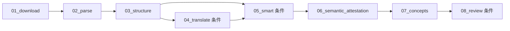

# Document 处理步骤

> 运行时步骤和依赖的单一来源是 `configs/pipelines.yaml::document`。本文说明稳定边界，不复制超时和模型路由。

## 统一模型

论文、网页文章、白皮书、报告、标准和书章的顶层类型都是 `content_type=document`。体裁写入可扩展的
`document_kind`；解析方法只由真实来源形态和 capability 决定：

- `scholarly_html`：学术 HTML、MathML、bibliography、Figure/Table。
- `generic_html`：普通网页的正文树、链接、资源、嵌入物和完整度门。
- `digital_pdf`：text layer、页码、bbox、Figure/Table 区域。
- `scanned_pdf`：OCR、页码、bbox 和置信度；低置信文字不能成为 exact-quote 证据。

同一个 `document_kind=whitepaper` 可以来自 HTML 或 PDF；不能用体裁选择 adapter。

## DAG

## 产物边界

| 步骤 | 关键输入 | 关键输出 | 不变量 |
|---|---|---|---|
| 01_download | URL 或上传 | `input/source.html`、`input/source.pdf`、metadata、assets | 原始来源不可变；同时存在 HTML/PDF 时两者都是独立 source |
| 02_parse | 原始 source | `intermediate/document.json`、`quality.json` | 所有 profile 输出同一个 Document Model；HTML/PDF crosswalk 只接受唯一高置信匹配 |
| 03_structure | Document Model | `source_segments.json`、PDF support | 稳定 block id 投影到既有 provenance；低置信 OCR 不发布逐字支持 |
| 04_translate | blocks + glossary | `translation.json`、`translated.html` | 支持 1:1、1:N、N:1 对齐；公式、数字、单位、引用等 token fail-closed |
| 05_smart | Document/Translation | 版本化智能笔记 + provenance | 标题由程序固定为“中文标题 - 笔记”；不读取原文 Markdown |
| 06–08 | 笔记、Document、证据 | attestation、concepts、review | locator、Figure/Table id 和 document kind 贯穿消费者 |

Document 不生成或读取 `output/original.md`、`output/translated.md`、`intermediate/figures.json`。
原文展示直接使用隔离后的 `input/source.html` 或 PDF.js；译文的真相源是 `translation.json`，
`translated.html` 只是可再生阅读视图。

## 原文、译文和证据定位

- HTML reader 保留 MathML、SVG、表格、图注、脚注与内部引用，剥离脚本、表单、站点 chrome 和外部追踪。
- PDF reader 使用 PDF.js；Document locator 的 `page+bbox` 绘制高亮 overlay。
- HTML 与译文使用稳定 block/segment anchor；可附 exact 文本高亮。
- Search、Ask、MCP、概念 occurrence、智能笔记 citation 和 Review issue 都消费同一 canonical locator。
- locator 的 source id 与 SHA 必须匹配 `document.sources[]`；来源变化后旧定位失效，不套用旧 offset。

## Figure/Table registry

`document.figures[]` 和 `document.tables[]` 分开建模、统一排序。Figure 支持零到多个 panel；Table
优先保存 cell 的 row/col/rowspan/colspan/role/bbox，恢复不可靠时保留 source crop 并标 degraded。
前端按“图 / 表”分组导航，稳定深链使用 `?tab=figures&visual=<id>`。

## 验证入口

- adapter/contract：`tests/steps/document/`、`tests/test_document_contract.py`。
- 原生阅读器：`tests/test_document_reader.py` 与 `frontend/src/components/document/`。
- migration：`tests/test_unified_document_migration.py`、`tests/test_db_migrations.py`。
- pipeline→Search/Ask/MCP：`tests/integration/test_pipeline_search_closure.py`。
