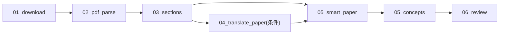

# 论文分析步骤

> 当前 paper pipeline 的权威步骤与依赖在 `configs/pipelines.yaml`；本文解释各步骤边界，不复制可变超时和模型配置。

## 总览

## Step 01: 下载

| 项目 | 值 |
|------|---|
| 实现 | `steps.common.step_01_download` |
| 池 | io |
| 输入 | `job.json` 中的 URL，或上传到 `input/source.pdf` 的文件 |
| 输出 | `input/source.pdf`、`input/metadata.json`；arXiv 可额外产 `input/source.html` 与 `assets/*` |

arXiv 优先同时抓官方 HTML 源和 PDF；直链论文与上传只保证 PDF。来源识别与可创建类型以 `configs/sources.yaml` 为准。

## Step 02: 论文解析

| 项目 | 值 |
|------|---|
| 实现 | `steps.paper.step_02_pdf_parse` |
| 池 | cpu |
| 依赖 | `01_download` |
| 输入 | `input/source.html` 或 `input/source.pdf` |
| 输出 | `intermediate/parsed.json`、条件产物 `intermediate/needs_translation.json`；HTML 模式另产 `output/original.md` |

该步骤保留历史名称 `02_pdf_parse`，实际有两种模式：

- `arxiv-html`：把 LaTeXML HTML 转成保留标题层级、公式、图片与图注的 Markdown，并提取章节和语言。
- `pdf-only`：用 `pdfinfo` 获取页数，用 metadata 与首页文本尽力恢复标题；不从 PDF 逆向抽正文，后续 AI 步直接按页读取 PDF。

`parsed.json.source_kind` 明确记录模式。非中文 HTML 与全部 pdf-only 输入写 `needs_translation.json`，由 pipeline 规则决定是否翻译。

## Step 03: 章节结构

| 项目 | 值 |
|------|---|
| 实现 | `steps.paper.step_03_sections` |
| 池 | cpu |
| 依赖 | `02_pdf_parse` |
| 输入 | `intermediate/parsed.json` |
| 输出 | `intermediate/sections.json` |

HTML 模式把扁平章节整理为树；pdf-only 模式保留页区间章节，供后续翻译与笔记步骤分段读取。只有真实正文时才渲染原文 Markdown。

## Step 04: 条件翻译

| 项目 | 值 |
|------|---|
| 实现 | `steps.paper.step_04_translate_paper` |
| 池 | ai |
| 依赖 | `03_sections` |
| 运行条件 | 存在 `intermediate/needs_translation.json` |
| 输出 | `output/translated.md` |

HTML 模式翻译 `original.md` 并保留 Markdown 结构；pdf-only 模式按页区间读取 PDF。中文输入跳过时，依赖仍视为满足。

## Step 05: 智能笔记与概念

`05_smart_paper` 依赖章节与条件翻译，优先使用译文，其次使用 HTML 原文；pdf-only 直接读取 PDF。输出为版本化的 `output/versions/notes_smart_*`。

`05_concepts` 随后复用文章概念步骤，产出 `output/concepts.json`，把摘要、概念中文名与关系交给索引和概念图消费。

## Step 06: 质量评审

| 项目 | 值 |
|------|---|
| 实现 | `steps.paper.step_06_review` |
| 池 | ai |
| 依赖 | `05_concepts` |
| 输出 | 版本化 `output/versions/review_*` |

评审智能笔记的完整性、准确性、结构、术语、视觉整合与可读性。服务端和前端读取哪个版本，以 notes/review 契约为准。

## 验证入口

- 单步与行为测试：`tests/steps/test_step_02_pdf_parse.py`、`test_step_03_sections.py`、`test_step_translate_paper.py`、`test_step_05_smart_paper.py`、`test_step_06_review.py`。
- 当前真实接线 E2E：`tests/integration/ci_paper_e2e.sh`。它真实执行上传、pdf-only 解析与章节树，AI 步在 `DRY_RUN=1` 下只验证接线和产物契约。
- 外网 arXiv 与真实 AI 属凭证/网络条件验证，不等同于主 CI 单测。
