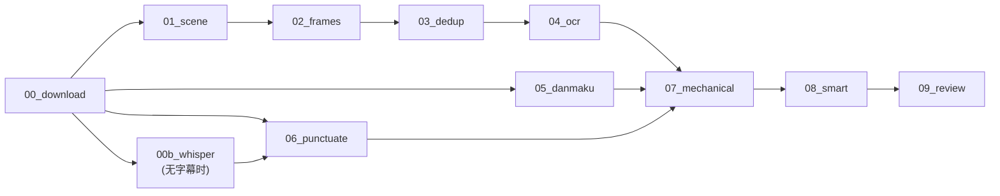

# 视频分析步骤

> 视频 pipeline 的步骤设计、接口、实现要点、验证标准。每步继承 StepBase 基类。

## 总览



## Step 00: 下载 (00_download.py)

| 项目 | 值 |
|------|---|
| 池 | io |
| 依赖 | 无 |
| 超时 | 10min |
| 重试 | 3 |
| 输入 | job.json (url + source) |
| 输出 | input/source.mp4, input/subtitle.srt, input/danmaku.ass, input/metadata.json |

### 来源识别

| 来源 | 识别规则 | 下载器 | 字幕 |
|------|---------|--------|------|
| B站 | `bilibili.com` 或 `BV` 开头 | yutto | AI 字幕 |
| YouTube | `youtube.com` / `youtu.be` | yt-dlp | CC 字幕 |
| 本地上传 | job.json 有 `upload: true` | 不需要 | 手动/Whisper |
| 其他 | 兜底 | yt-dlp 通用 | 可能无 |

### Cookies

B站 1080P 需要登录 cookies（`/data/cookies/bilibili.txt`）。无 cookies 降级 480P。

### 验证

- input/source.mp4 存在且 >1MB
- input/metadata.json 有 duration_sec >0
- B站视频有 subtitle.srt

## Step 00b: Whisper 语音转写 (00b_whisper.py)

| 项目 | 值 |
|------|---|
| 池 | gpu（回退 cpu，但极慢） |
| 依赖 | 00_download |
| 条件 | input/ 下无 .srt 文件 |
| 超时 | 30min |
| 输入 | input/source.mp4 |
| 输出 | input/subtitle.srt |

GPU 可用时用 faster-whisper large-v3（float16），仅 CPU 时用 base（int8）。根据显存自动选模型大小。

## Step 01: 场景检测 (01_scene.py)

| 项目 | 值 |
|------|---|
| 池 | scene（独占 CPU） |
| 依赖 | 00_download |
| 超时 | 10min |
| 输入 | input/source.mp4 |
| 输出 | intermediate/scenes.json |

使用 PySceneDetect AdaptiveDetector。配置项在 `configs/domain/{domain}.yaml` 的 `scene` 段。

### 关键配置

```yaml
scene:
  adaptive_threshold: 3.0
  min_scene_len_sec: 2.0
  window_width: 2
  min_content_val: 15.0
```

### 验证

- scenes.json 可解析
- scenes 数组非空
- 首个 scene 的 start_sec == 0
- 末个 scene 的 end_sec ≈ 视频时长 (±2s)

## Step 02: 关键帧提取 (02_frames.py)

| 项目 | 值 |
|------|---|
| 池 | cpu |
| 依赖 | 01_scene |
| 超时 | 2min |
| 输入 | intermediate/scenes.json + input/source.mp4 |
| 输出 | assets/*.jpg + intermediate/candidates.json |

每个场景取一张代表帧。超长场景（>30s）额外保底采样（每 15s 一张）。

### 代表帧选取策略

- 场景内 SSIM 变化小（静态）→ 取中间帧
- 场景内 SSIM 变化大（动态）→ 取 70% 位置的帧（等内容稳定后）

### 验证

- assets/*.jpg 数量 ≥ scenes 数
- 每张 jpg >10KB
- candidates.json 按 timestamp 排序

## Step 03: 截图去重 (03_dedup.py)

| 项目 | 值 |
|------|---|
| 池 | cpu |
| 依赖 | 02_frames |
| 超时 | 2min |
| 输入 | intermediate/candidates.json + assets/*.jpg |
| 输出 | intermediate/dedup.json |

两级去重：pHash 快速筛 → SSIM 精确确认。

```yaml
dedup:
  phash_hash_size: 8
  phash_threshold: 6
  ssim_threshold: 0.92
  ssim_resize: [320, 180]
```

### 验证

- dedup.json 长度 == candidates.json 长度
- 每项有 keep (bool) 和 phash (string)
- 保留率 25%-100%

## Step 04: OCR (04_ocr.py)

| 项目 | 值 |
|------|---|
| 池 | cpu / gpu |
| 依赖 | 03_dedup |
| 超时 | 5min |
| 输入 | intermediate/dedup.json + assets/*.jpg (keep=true) |
| 输出 | intermediate/ocr.json |

CPU 用 RapidOCR (ONNX)，GPU 用 PaddleOCR。通过 `device.py` 自动选路径。

### 验证

- ocr.json 长度 == keep=true 的帧数
- nonempty >30%（讲解类视频大部分帧有文字）

## Step 05: 弹幕提取 (05_danmaku.py)

| 项目 | 值 |
|------|---|
| 池 | io |
| 依赖 | 00_download |
| 条件 | input/ 下有 .ass 文件 |
| 超时 | 30s |
| 输入 | input/*.ass |
| 输出 | intermediate/danmaku.json |

解析 ASS 格式，过滤特效标签（`\move` 等），按时间排序。无 ASS 文件时输出空数组。

## Step 06: 字幕加标点 (06_punctuate.py)

| 项目 | 值 |
|------|---|
| 池 | ai |
| 依赖 | 00_download（或 00b_whisper） |
| 条件 | input/ 下有 .srt 文件 |
| 超时 | 5min |
| 输入 | input/*.srt |
| 输出 | output/transcript.md |

AI 自动生成的字幕没有标点。用 Claude 给每行补标点，保留 `[MM:SS]` 时间戳。

长视频（>30000 字符）自动分块处理。

### 验证

- transcript.md 保留 `[MM:SS]` 时间戳
- 包含中文标点
- 行数与原 SRT 一致 (±10%)

## Step 07: 机械版笔记 (07_mechanical.py)

| 项目 | 值 |
|------|---|
| 池 | io (纯 Python 拼接) |
| 依赖 | 04_ocr + 05_danmaku + 06_punctuate |
| 超时 | 30s |
| 输入 | intermediate/dedup.json + ocr.json + danmaku.json + output/transcript.md |
| 输出 | output/notes_mechanical.md |

将截图、OCR、弹幕、逐字稿按时间线拼接成 Markdown。自动按时间切分章节（每 ~3 分钟一章）。

这是给 08_smart 的输入素材，也可独立阅读。

## Step 08: 智能版笔记 (08_smart.py)

| 项目 | 值 |
|------|---|
| 池 | ai |
| 依赖 | 07_mechanical |
| 超时 | 10min |
| 输入 | output/notes_mechanical.md + assets/*.jpg |
| 输出 | output/notes_smart.md |
| AI 需求 | **视觉模型**（完整模式）或纯文本模型（降级模式） |

AI 将机械版素材重组为结构化笔记：提炼要点、解释术语、组织章节、引用关键截图。

Prompt 在 `/data/prompts/smart_notes.md`，可按集合的 Prompt Profile 覆盖。

### 两种模式

**完整模式**（tags: ["vision"]）：AI 直接看截图 → 理解图表/PPT/损失曲线 → 写出视觉相关描述。需要视觉模型（Claude Sonnet/GPT-4o/Gemini Pro）。

**降级模式**（text_fallback）：AI 只看机械笔记中的 OCR 文字描述 → 根据文字推断内容。可用纯文本模型（DeepSeek/本地 32B）。质量较低但成本低 90%+。

步骤代码根据 Gateway 返回的 Provider 是否支持 vision 自动选择模式：
```python
if response.provider_features.includes("vision"):
    # 完整模式：传入截图
    result = self.call_ai(prompt, images=frame_paths)
else:
    # 降级模式：只传 OCR 文字
    result = self.call_ai(prompt_text_only)
```

### 验证

- notes_smart.md >500 字符
- 包含 `##` 章节标题
- 引用的 `` 路径在 assets/ 下存在
- 不含 "作为AI" / "我无法" 等拒绝话术

## Step 09: 质量评审 (09_review.py)

| 项目 | 值 |
|------|---|
| 池 | ai |
| 依赖 | 08_smart |
| 超时 | 2min |
| 输入 | output/notes_mechanical.md + notes_smart.md |
| 输出 | output/review.json |

6 维度评分（1-5）+ 缺失概念 + 改进建议。评审结果可反馈到 Prompt Profile 优化。

### 验证

- review.json 有 overall (1-5)
- 有 6 个维度评分
- 有 missing_concepts 数组
- 有 top3_improvements 数组

## 验证框架

```bash
# 单步验证（用原型产物做输入）
python3 steps/04_ocr.py --job-dir /data/test/BV1example001
python3 verify_step.py --step 04_ocr --job-dir /data/test/BV1example001

# 全流程验证
for step in 01_scene 02_frames 03_dedup 04_ocr 05_danmaku 06_punctuate 07_mechanical 08_smart 09_review; do
    python3 verify_step.py --step $step --job-dir /data/test/BV1example001
done
```

如有原型项目的已有产物，可直接用作任何步骤的测试输入。
