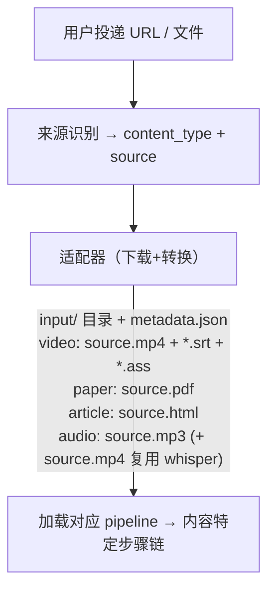

# 05 · 内容适配器

> 不同来源的内容如何接入系统。视频是 M1，论文是 M1，文章 + 音频/播客是 M6。

## 1. 适配器模型

每种内容来源对应一个适配器。适配器负责：下载原始内容 + 生成统一的 input/ 目录结构。



适配器是 `01_download` 步骤（`steps/common/step_01_download.py`）的内部实现——同一个步骤脚本，根据 content_type 和 source 选择不同的下载/转换逻辑。

## 2. 视频适配器（M1）

### B站

| 项目 | 值 |
|------|---|
| 识别 | URL 含 `bilibili.com` 或以 `BV` 开头 |
| 下载器 | yutto |
| 字幕 | AI 自动字幕（大部分视频有） |
| 弹幕 | ASS 格式 |
| Cookies | 扫码登录获取，1080P 需要 |
| 批量 | 支持 UP主 mid 批量导入 |

### YouTube

| 项目 | 值 |
|------|---|
| 识别 | URL 含 `youtube.com` 或 `youtu.be` |
| 下载器 | yt-dlp |
| 字幕 | CC 字幕 |
| 弹幕 | 无 |
| Cookies | 免费视频不需要，会员视频需手动上传 |

### 本地上传

| 项目 | 值 |
|------|---|
| 识别 | multipart 上传 |
| 字幕 | 可选上传 .srt，无则走 Whisper |
| 大小限制 | 2GB |

### 通用 URL

yt-dlp 支持的其他网站，作为兜底。

## 3. 论文适配器（M1 已实现;2026-07 源头重做:HTML 优先 / PDF 直喂兜底）

```
输入: PDF 上传 或 arXiv URL
输出: input/source.pdf + input/metadata.json
      + input/source.html + assets/*      (仅 arxiv 且 HTML 源可得)
```

- **arxiv**:PDF 照旧下载(下载入口/无 HTML 兜底);同时抓 **HTML 源**(官方 `arxiv.org/html/<id>`
  → 404 再 `ar5iv.labs.arxiv.org/html/<id>`),页内图片下载到 job 根 `assets/` 并把引用重写为
  `assets/<名>`。`02_pdf_parse`(步名保留,语义=论文解析)把 LaTeXML HTML 转干净 Markdown
  (`steps/utils/html_paper.py`:标题层级 / `<math alttext>`→`$…$``$$…$$` / 图+图注 / 表 best-effort)
  → `output/original.md` + `sections.json`,`parsed.json.source_kind="arxiv-html"`。
  原文展示 / 翻译 / 笔记全部吃这份干净 MD——pymupdf 从 PDF 逆向文本断词、公式丢,已弃用。
- **只有 PDF 的**(会议论文/直链 PDF/老论文 LaTeX 编译失败):`source_kind="pdf-only"`,不产
  original.md(原文页=内嵌 PDF 浏览器原生渲染);AI 步(翻译/笔记)**直接喂 PDF**
  (claude Read 工具按页区间读,worker 镜像带 poppler-utils 渲染)。

## 4. 文章适配器（M6 已实现）

```
输入: 网页 URL（公众号/博客/新闻）
输出: input/source.html + input/article_meta.json
```

用 trafilatura 提取正文（中文友好，纯 Python），保留图片引用；同时落一份正文/标题供后续解析步使用。

## 5. 音频 / 播客适配器（M6 已实现）

```
输入: 单集音频 URL 或音频文件上传（.mp3/.m4a/.wav/.aac）
输出: input/source.mp3 (+ input/source.mp4 复用 whisper) + input/metadata.json
```

只取单集音频，无 RSS 订阅（RSS 追更留 M4/Agent）。下载后复用 video 的 whisper 步转写（`02_whisper` 入参约定为 `source.mp4`，故同时落一份），再走 audio pipeline：`01_download → 02_whisper → 03_transcript_parse → 04_smart_podcast → 05_review`。

## 6. Cookies 管理

凭证单一持久源 = DB `credentials` 表(B站扫码登录写 `bili_cookies` JSON;YouTube 经
`POST /api/auth/youtube/cookies` 上传写 `youtube_cookies` Netscape 文本),写入时镜像
redis `cred:{key}`,worker 认领下载步时经 transport 领取(契约见 docs/03 §1.7.1)。
cookie 文件共享目录已废除:新增 worker 零预置,凭证过期只需在中心刷新一次。

状态由 `GET /api/auth/status` 实时返回(按 DB 凭证有无判定):

```json
{
  "bilibili": {"has_cookies": true, "status": "ok"},
  "youtube":  {"has_cookies": false, "status": "missing"}
}
```

### Cookies 缺失/失效时的降级

下载步缺少有效 B站凭证(中心未配置/已失效)时不报错中断，而是降级：

```
01_download 执行 → 取不到 SESSDATA（env 未注入 + 无侧载凭证）
  → 记日志 no_bilibili_cookies（warn）
  → 匿名下载：清晰度降到 480P、无字幕（字幕需登录）
```

用户可在前端重新扫码登录(写入 DB)或上传 cookie 文件后重跑下载步取回 1080P。

B站 cookies 有效期约 1-3 个月。YouTube cookies 有效期数月，较少过期。


## 在线书(book_toc)

book = **collection(source_type=`book_toc`,source_id=书目录 URL)+ 每章一个 article job**。
首个实现认 jupyter-book / sphinx 目录结构(QuantEcon 系列):`<a class="reference internal">` 文档序即章序;
根路径 meta-refresh(如 QuantEcon `/`→`intro.html`)自动跟随。章数上限 env `BOOK_MAX_CHAPTERS`(默认 5)。

- 章 job 走 article 链(HTML 单页→MD→翻译→笔记→概念),强制 `smart_note=true`。
- **章序串行**:sync 全量建章但 defer(不触发调度),scheduler 在前章终态(done/failed——失败不卡书,
  失败章单独 rerun)按 `created_at` 序 submit 下一章(`shared/book_chain.py`)。
- **书级术语一致性(L2)**:章翻译回流 merge 进 `collections/{id}/terms.json`(先到先得),
  后章 term_map 合并注入 → 前章定名约束后章(docs/03 §4.10)。
- 前端集合详情对 book 按章序(建章顺序)展示。
