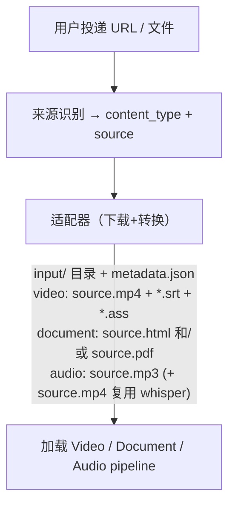

# 05 · 内容适配器

> 不同来源的内容如何接入系统。顶层内容族是 Video、Document、Audio。

## 1. 适配器模型

每种内容来源对应一个适配器。适配器负责：下载原始内容 + 生成统一的 input/ 目录结构。
内容类型、可创建来源、上传扩展名和订阅来源的权威注册表是
[`configs/sources.yaml`](../configs/sources.yaml)；API 的 OpenAPI enum、入队校验、本地目录扫描和
前端来源目录均从它派生。新增来源必须同时实现真实适配器，完整性测试会拒绝 registry 与实现不一致。



适配器是 `01_download` 步骤（`steps/common/step_01_download.py`）的内部实现——同一个步骤脚本，根据 content_type 和 source 选择不同的下载/转换逻辑。

### 1.1 多模态 provenance sidecar

可定位笔记必须显式产出 `intermediate/source_segments.json` 和
`output/provenance/{note_type}.json`。前者登记原始来源 artifact 摘要及 media/PDF/text segment；
后者把笔记中唯一可解的文本锚点绑到一个或多个 source segment。Scheduler 只在两份 sidecar、
当前 note 和当前 chunk 边界全部重验通过后写 canonical evidence。

- video/audio 用毫秒区间绑定媒体；时长越界失败。video OCR 额外把机械稿实际渲染且唯一的画面文字绑定到 image locator。
- PDF 用真实页码和可选 `[x0,y0,x1,y1]` bbox，不把伪章节序号当页码。
- Document HTML 用 `exact+prefix+suffix+dom_path` 锚定 UTF-8 原文；多解或无解不入库。
- video image locator 只从 `06_ocr` 同时记录的帧 SHA-256、真实尺寸、时间戳和 OCR 框生成。`08_punctuate` 等 OCR 完成后一次发布来源清单；当前帧 hash/尺寸不符、bbox 超出图像或机械稿未实际渲染该帧时均不发布映射。其他图片来源仍不能推断或伪造 bbox。

sidecar writer 使用 v2。source segment 除 locator 外还携带完整且不超过 4096 bytes 的
`support_text` 和指向实际 producer 产物的 `support_artifact`，没有可复算文本时两者都为
`null`；note mapping 声明
`verification_policy=direct_locator_v1|exact_quote_v1`。v1 的确定性 original/transcript/mechanical
映射继续可读，但历史 smart 非空映射不受信任。

AI smart note 的 marker 只负责选择候选 segment，不能自证事实。producer 移除 marker 后保留唯一整行
claim；每行恰好一个 source segment，该行只经 NFC 和有限空白归一后仍逐字包含于该
segment 的 `support_text`，且 producer 与 Scheduler 都重读 `support_artifact` 复算通过，才以
`exact_quote_v1` 发布。PDF-only 由 Poppler 一次提取全文后按实测页严格分配有界原文，
marker 展示该页真实原文摘要，不用页码标签冒充支持；空白、提取失败或超限页保持 `null`。改写、概括、
纯数字、无支持页、未知引用和任意多引用均不产生映射。译文及基于跨语言译文生成的 claim 在独立 attestation 落地前保持
`written_empty`，不得把翻译等价冒充逐字证据。transcript、mechanical 和 original 的确定性映射不受影响。

三类 pipeline 的 producer 和消费者必须在同一交付中整合；仅有前端投影或仅有 DB 表都不代表该闭环完成。

## 2. 视频适配器（M1）

### B站

| 项目 | 值 |
|------|---|
| 识别 | URL 含 `bilibili.com` 或以 `BV` 开头 |
| 下载器 | yutto |
| 字幕 | AI 自动字幕（大部分视频有） |
| 弹幕 | ASS 格式 |
| Cookies | 扫码登录获取，1080P 需要 |
| 批量 | 支持 UP主 mid 批量导入 |

### YouTube

| 项目 | 值 |
|------|---|
| 识别 | URL 含 `youtube.com` 或 `youtu.be` |
| 下载器 | yt-dlp |
| 字幕 | CC 字幕 |
| 弹幕 | 无 |
| Cookies | 免费视频不需要，会员视频需手动上传 |
| 批量 | 支持频道和 playlist；playlist 中每个 video ID 建独立任务并幂等追更 |

课程录像优先使用 `youtube_playlist` 订阅集合，而不是订阅整个频道。适配器接受 playlist URL、带
`list` 参数的 watch/youtu.be URL 或裸 playlist ID，经 yt-dlp `--flat-playlist` 浅枚举后输出标准
watch URL。列表本身不进入 video 下载链，每个条目继续复用现有 YouTube 下载、字幕和笔记流水线。

### 本地上传

| 项目 | 值 |
|------|---|
| 识别 | multipart 上传 |
| 字幕 | 可选上传 .srt，无则走 Whisper |
| 大小限制 | 2GB |

### 未注册 URL

没有命中 registry 的 URL 或裸标识在 API 写文件、写 DB、发布队列之前返回 422。系统不再把未知来源
静默当成视频交给 yt-dlp；要接入新站点，先登记来源及允许的内容类型，再实现下载适配器并补接线测试。

## 3. Document 适配器

论文、网页文章、白皮书、报告、标准、书章等都创建为 `content_type=document`、
`pipeline=document`。`document_kind` 保存体裁，source profile/capability 选择技术解析器，两者正交。

共同产物：

```
input/source.html|source.pdf       不可变来源，可同时存在
intermediate/document.json        身份、元数据、文档树、资源、引用、locator
intermediate/quality.json         complete/degraded/rejected 与完整度指标
output/translation.json           翻译对齐真相源
output/translated.html            可再生译文阅读视图
```

### 学术 HTML

arXiv 尽可能同时保存官方/ar5iv HTML 和 PDF。HTML 由 `scholarly_html` adapter 保留 MathML、
bibliography、作者-机构-邮箱关系、作者说明、许可、Figure/Table 与内部引用；原文 Tab 显示 CSP+sandbox
隔离副本，不再转成 Markdown。若 PDF 同时存在，按规范化文本建立唯一 HTML↔PDF crosswalk；重复或无
匹配只记录 ambiguous/unmatched，不能猜页码。

### 通用网页

`generic_html` adapter 保存 canonical/final URL、正文树、标题层级、列表、引用、code、表格 span、
assets 和安全 embed。正文边界、付费墙、动态壳、分页和截断进入质量门；章节和图片归属不由短行或邻近
文本启发式充当真相。

### 数字和扫描 PDF

数字 PDF 读取 text layer 并保存页码、bbox、reading order；表格布局满足行列稳定条件时产 cell+bbox，
否则保存完整 source crop 并标 degraded。扫描 PDF 使用 OCR page+bbox+confidence；低于质量阈值的文字
只允许区域定位，不发布 exact-quote support。原文用 PDF.js 展示并叠加 bbox，不制造原文 HTML/Markdown。

### 翻译和知识加工

翻译按稳定 block/segment 批次执行，支持 1:1、1:N、N:1；公式、数字、单位、引用等 protected token
丢失即重试后 fail-closed。Search、Ask、MCP、概念、智能笔记和 Review 只消费 Document/Translation
locator 与 Figure/Table id，不读取 `original.md`、`translated.md` 或 `figures.json`。

## 5. 音频 / 播客适配器（M6 已实现）

```
输入: 单集音频 URL 或音频文件上传（.mp3/.m4a/.wav/.aac）
输出: input/source.mp3 (+ input/source.mp4 复用 whisper) + input/metadata.json
```

直接投递仍以单集音频 URL 或文件为单位。RSS / Atom 由订阅集合枚举条目，再把每个 enclosure 或
落地页作为独立 job 入库。下载后复用 video 的 whisper 步转写（`02_whisper` 入参约定为
`source.mp4`，故同时落一份），再走 audio pipeline：
`01_download → 02_whisper → 03_transcript_parse → 04_smart_podcast → 05_review`。

## 6. Cookies 管理

凭证单一持久源 = DB `credentials` 表(B站扫码登录写 `bili_cookies` JSON;YouTube 经
`POST /api/auth/youtube/cookies` 上传写 `youtube_cookies` Netscape 文本),写入时镜像
redis `cred:{key}`,worker 认领下载步时经 transport 领取(契约见 docs/03 §1.7.1)。
cookie 文件共享目录已废除:新增 worker 零预置,凭证过期只需在中心刷新一次。

状态由 `GET /api/auth/status` 实时返回(按 DB 凭证有无判定):

```json
{
  "bilibili": {"has_cookies": true, "status": "ok"},
  "youtube":  {"has_cookies": false, "status": "missing"}
}
```

### Cookies 缺失/失效时的降级

下载步缺少有效 B站凭证(中心未配置/已失效)时不报错中断，而是降级：

```
01_download 执行 → 取不到 SESSDATA（env 未注入 + 无侧载凭证）
  → 记日志 no_bilibili_cookies（warn）
  → 匿名下载：清晰度降到 480P、无字幕（字幕需登录）
```

用户可在前端重新扫码登录(写入 DB)或上传 cookie 文件后重跑下载步取回 1080P。

B站 cookies 有效期约 1-3 个月。YouTube cookies 有效期数月，较少过期。


## 在线书(book_toc)

book = **collection(source_type=`book_toc`,source_id=书目录 URL)+ 每章一个 `document_kind=book_chapter` job**。
首个实现认 jupyter-book / sphinx 目录结构(QuantEcon 系列):`<a class="reference internal">` 文档序即章序;
根路径 meta-refresh(如 QuantEcon `/`→`intro.html`)自动跟随。章数上限 env `BOOK_MAX_CHAPTERS`(默认 5)。

- 章 job 走 Document 链(HTML→Document Model→翻译→笔记→概念),强制 `smart_note=true`。
- **章序串行**:sync 全量建章但 defer(不触发调度),scheduler 在前章终态(done/failed——失败不卡书,
  失败章单独 rerun)按 `created_at` 序 submit 下一章(`shared/book_chain.py`)。
- **书级术语一致性(L2)**:章翻译回流 merge 进 `collections/{id}/terms.json`(先到先得),
  后章 term_map 合并注入 → 前章定名约束后章(docs/03 §4.10)。
- 前端集合详情对 book 按章序(建章顺序)展示。
