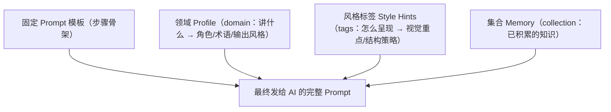
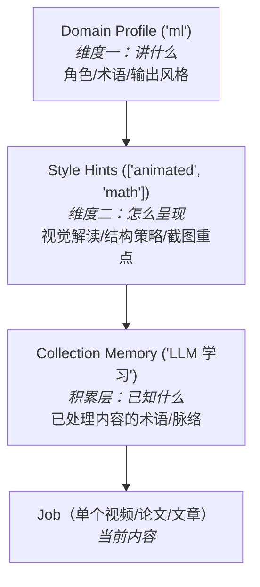
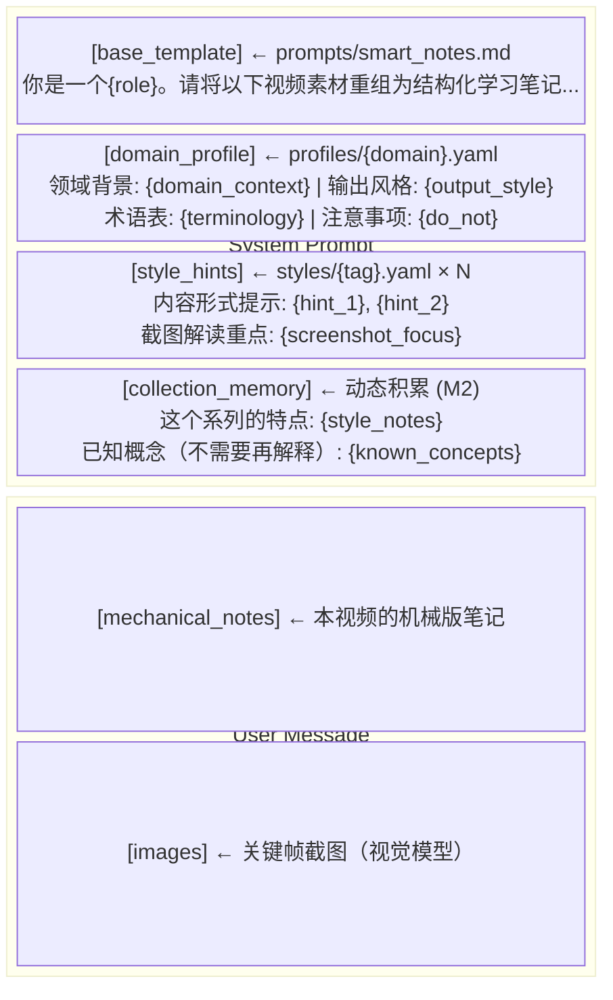

# 06 · Prompt 工程

> Prompt 模板 + 领域 Profile + 内容风格标签 + 记忆积累。两个正交维度决定 Prompt：讲什么（Domain）× 怎么呈现（Style）。

## 1. 核心思路



### 两个正交维度

```
              Domain（讲什么）
              dl       ml    math    ...
Style      ┌────────┬───────┬───────┐
(怎么呈现)  │        │       │       │
animated   │ DL动画 │3B1B式 │ 数学  │  → 每帧有意义，描述动画变化
lecture    │ DL课   │ML课堂 │ 数学课│  → 关注板书PPT，忽略口水话
code-heavy │   —    │代码教程│   —   │  → 还原代码，按概念分块
talk       │ AI研讨 │AI峰会 │   —   │  → 正式结构，Q&A段
           └────────┴───────┴───────┘
```

Domain 决定术语和角色，Style 决定怎么解读视觉内容和组织结构。两者独立组合。

### 四层 Prompt 组装



四层分离：
- **模板**：步骤通用结构（"请重组为结构化笔记"），所有内容共享
- **Profile**：领域特有的角色、术语、输出风格（"你是技术文档编辑"），同 domain 共享
- **Style Hints**：内容形式特有的解读策略（"每帧动画变化都有意义"），按标签组合
- **Memory**：该 Collection 积累的知识（"Attention 已在之前视频解释过"），单 Collection 独有

## 2. 领域 Profile（M1 就需要）

不同类型视频的笔记质量高度依赖 Prompt 的领域适配。**M1 必须支持 Profile**。

### 配置文件

```yaml
# /data/prompts/profiles/deep-learning.yaml
domain: deep-learning
role: "深度学习领域编辑"
domain_context: "深度学习相关视频（模型架构、训练方法、推理优化、论文复现等）"

output_style:
  structure: "按'背景→方法→结果→结论'组织论文/方法类内容"
  terminology_handling: "首次出现的术语用'**术语**（解释）'格式"
  visual_focus: "损失曲线/架构图需要描述趋势与结构，不只读数字"

terminology:
  - "注意力: 让模型为不同输入位置分配权重的机制"
  - "微调: 在预训练模型上针对特定任务继续训练"
  - "蒸馏: 用大模型(教师)指导小模型(学生)训练，压缩模型"
  - "量化: 用低位宽表示权重/激活，降低显存与计算开销"
  - "过拟合: 模型在训练集表现好但泛化差"

do_not:
  - "不要给出无依据的性能结论"
  - "不要评价视频质量或UP主水平"
```

```yaml
# /data/prompts/profiles/programming.yaml
domain: programming
role: "技术文档编辑"
domain_context: "编程/AI/系统设计相关技术讲解视频"

output_style:
  structure: "按'概念→原理→实现→应用'组织"
  terminology_handling: "术语保留英文原文，括号附中文'Transformer（变换器）'"
  visual_focus: "代码截图需要尝试还原代码文本，架构图描述组件关系"
  code_blocks: "识别到代码时用 ``` 代码块格式"

terminology:
  - "Transformer: 基于自注意力机制的神经网络架构"
  - "Fine-tuning: 微调，在预训练模型上针对特定任务继续训练"
  - "LoRA: 低秩自适应，参数高效的微调方法"
  - "RAG: 检索增强生成，结合搜索和生成的方法"

do_not:
  - "不要简化技术细节"
  - "不要省略代码和公式"
```

```yaml
# /data/prompts/profiles/general.yaml (默认)
domain: general
role: "学习笔记编辑"
domain_context: "通用学习视频"

output_style:
  structure: "按视频自然章节组织"
  terminology_handling: "专业术语附简要解释"

terminology: []
```

### Profile 选择

Job 创建时指定 `domain`，Gateway 自动加载对应 Profile。如果不指定，系统根据内容自动推断（可选，M2）。

## 3. 风格标签 Style Hints（M1）

Domain Profile 管"讲什么"，Style Hints 管"怎么呈现"。同样是 ML 视频，3B1B 动画和课堂录制的笔记策略完全不同。

### 内置标签

```yaml
# /data/prompts/styles/animated.yaml
tag: animated
name: "动画讲解"
description: "3Blue1Brown 式可视化动画，每帧变化都有教学意义"
hints:
  - "每一帧的视觉变化都有教学意义，不要跳过任何动画过渡"
  - "重点描述'从A变换到B'的过程，而非静态结果"
  - "数学直觉和几何意义比公式推导更重要"
screenshot_focus: "描述动画变换过程（如矩阵旋转、向量移动），不只是最终画面"
```

```yaml
# /data/prompts/styles/lecture.yaml
tag: lecture
name: "课堂录制"
description: "教室/会议室录制的授课视频，有黑板/PPT/白板"
hints:
  - "关注板书和PPT上的内容，忽略讲师的口头填充词和重复"
  - "按教学逻辑组织笔记，而非严格按时间线"
  - "如果讲师纠正了之前的说法，以修正后的为准"
screenshot_focus: "提取板书/PPT 上的关键文字和图表"
```

```yaml
# /data/prompts/styles/code-tutorial.yaml
tag: code-tutorial
name: "代码教程"
description: "屏幕录制的编程教学，大量代码展示"
hints:
  - "截图中的代码必须尽量还原为代码块（使用 ```语言 格式）"
  - "按概念/功能分块组织，而非按编码顺序"
  - "保留完整的命令行操作和输出结果"
screenshot_focus: "优先还原代码文本，注意编辑器中的文件名和行号"
```

```yaml
# /data/prompts/styles/talk.yaml
tag: talk
name: "会议演讲"
description: "技术大会/学术会议的演讲录像"
hints:
  - "注意区分主讲人观点和提问者的问题"
  - "Q&A 部分单独整理"
  - "PPT 要点和口头补充内容对照记录"
screenshot_focus: "提取 PPT 要点，忽略会场环境"
```

```yaml
# /data/prompts/styles/case-study.yaml
tag: case-study
name: "案例分析"
description: "围绕具体案例展开的讲解（如系统设计案例、论文方法案例）"
hints:
  - "按'背景 → 过程 → 结果 → 结论'四阶段组织"
  - "时间线和因果关系是核心，保留关键时间点"
  - "案例涉及的模块/方法关系要理清"
screenshot_focus: "数据图表（损失曲线、指标表格等）重点描述趋势和关键数据点"
```

```yaml
# /data/prompts/styles/math-visual.yaml
tag: math-visual
name: "数学可视化"
description: "包含大量公式推导和几何图形"
hints:
  - "公式用 LaTeX 格式记录（$..$ 行内，$$...$$ 独立行）"
  - "推导过程的每一步都要保留，标注关键变换"
  - "几何图形描述空间关系和变换方向"
screenshot_focus: "公式截图必须完整还原为 LaTeX，图形描述坐标关系"
```

### 用户自定义标签

除内置标签外，用户可创建自定义标签：

```
POST /api/styles
{
  "tag": "my-podcast",
  "name": "播客访谈",
  "hints": ["区分主持人和嘉宾发言", "保留对话的问答结构"]
}
```

### 标签组合

投递时可选多个标签，hints 合并：

```
投递 URL + domain="ml" + style_tags=["lecture", "code-tutorial"]
  → ml Profile 的术语/角色
  + lecture 的"关注板书，按教学逻辑组织"
  + code-tutorial 的"还原代码用代码块"
```

前端投递页展示常用标签供勾选（可多选）：

```
┌──────────────────────────────────────┐
│ 内容风格（可多选）:                   │
│                                      │
│ [✓] 课堂录制    [ ] 动画讲解         │
│ [✓] 代码教程    [ ] 会议演讲         │
│ [ ] 案例分析    [ ] 数学可视化       │
│ [ ] + 自定义...                      │
└──────────────────────────────────────┘
```

## 4. 集合 Memory（M1 基础版 + M2 完善）

### M1：静态 Memory

手动维护，存在 Profile 的 `terminology` 和 `style_notes` 中。处理第一批视频时人工审核并补充。

### M2：动态 Memory 积累

每处理完一个视频，从多个来源自动积累知识：

```
积累来源：
├── 09_review 的 missing_concepts → 补充到术语表
├── 09_review 的 top3_improvements → 补充到 style_notes
├── 06_punctuate 的字幕高频专业词 → 候选术语
├── 04_ocr 的高频出现文字 → 候选术语
└── 用户手动标注 → 直接加入
```

```python
async def accumulate_memory(collection_id: str, job_id: str):
    profile = load_profile(collection_id)
    review = load_review(job_id)
    transcript = load_transcript(job_id)

    # 从 review 提取缺失概念
    for concept in review.get("missing_concepts", []):
        if concept not in existing_terms(profile):
            profile["terminology"].append(f"{concept}: (待补充定义)")

    # 从字幕提取高频专业词（TF-IDF 或规则匹配）
    new_terms = extract_domain_terms(transcript, profile["domain"])
    for term in new_terms:
        if term not in existing_terms(profile):
            profile["candidate_terms"].append(term)  # 候选，需人工确认

    # 积累 style 发现
    for tip in review.get("top3_improvements", []):
        if is_generalizable(tip):  # 不是针对单个视频的具体建议
            profile["style_notes"].append(tip)

    save_profile(collection_id, profile)
```

### Memory 的作用

术语表越丰富 → 08_smart 生成笔记时术语解释越准确 → review 评分越高 → 形成正反馈循环。

```
第 1 个视频: profile 几乎为空 → 笔记质量一般 → review 补充 5 个术语
第 5 个视频: profile 有 20 个术语 → 笔记质量明显提升
第 20 个视频: profile 有 80 个术语 → 笔记接近专业水平
```

## 5. Prompt 组装

### 08_smart 的完整 Prompt 结构



### 06_punctuate / 09_review

这两步的 Prompt 简单，只用 base_template，不需要领域 Profile（加标点和评分是通用能力）。

## 6. Profile 与 Style 管理

### API

```
GET  /api/profiles                    → 所有 Profile 列表
GET  /api/profiles/{domain}           → 单个 Profile
PUT  /api/profiles/{domain}           → 更新 Profile
POST /api/profiles/{domain}/terms     → 添加术语
DELETE /api/profiles/{domain}/terms/{term}  → 删除术语
```

### 前端 Profile 编辑页

```
┌────────────────────────────────────────────┐
│ ← Profile: deep-learning (DL)              │
├────────────────────────────────────────────┤
│                                            │
│  角色: [深度学习领域编辑        ]          │
│  背景: [深度学习相关视频...     ]          │
│                                            │
│  ── 输出风格 ──                            │
│  结构: [按'背景→方法→结果→结论']           │
│  术语: [首次出现用**术语**（解释）]        │
│  视觉: [损失曲线描述趋势形态    ]          │
│                                            │
│  ── 术语表 (128 个) ──                     │
│  [+ 添加术语]                              │
│  注意力: 让模型分配权重 [✎] [✕]            │
│  微调: 在预训练模型上继续训练 [✎] [✕]      │
│  蒸馏: 用大模型指导小模型 [✎] [✕]          │
│  ...                                       │
│                                            │
│  ── 候选术语 (待确认, 5 个) ──             │
│  [✓] 自注意力   [✓] 残差连接               │
│  [✕] 批归一化   [✓] 强化学习               │
│  [确认选中]                                │
│                                            │
└────────────────────────────────────────────┘
```

## 7. 与幂等的关系

Profile 和 Style Hints 都是 08_smart 的输入 → 任一变化 → input_hash 变化 → 重跑。

```python
# 08_smart 的 input_hashes()
def input_hashes(self):
    # style_tags 排序后序列化，保证标签顺序不影响指纹
    style_hash = hash_style_tags(self.job_style_tags)
    return {
        "mechanical": file_hash(self.job_dir / "output/notes_mechanical.md"),
        "prompt": file_hash(Path("/data/prompts/smart_notes.md")),
        "profile": file_hash(Path(f"/data/prompts/profiles/{self.domain}.yaml")),
        "style_hints": style_hash,
    }
```

更新 Profile/Style 后 resubmit → 只有 08_smart 和 09_review 重跑。给同一个 Job 换标签也会触发重跑。

## 8. 跨内容类型、跨来源共享

### 同 Domain 共享 Profile

```
domain: "ml" 的 Profile
  → Collection "LLM 学习" 下的 B站视频 → 08_smart 用它
  → Collection "LLM 学习" 下的 arXiv 论文 → 14_smart_paper 用它
  → Collection "CV 入门" 下的 YouTube 视频 → 08_smart 也用它
```

术语表和风格说明是领域级别的，不绑定内容类型和来源。

### 同 Collection 共享 Memory

```
Collection "LLM 学习":
  处理 B站视频时积累了 "Attention" "Query/Key/Value" 等术语
    → 处理同 Collection 下的 arXiv 论文时，这些术语已在 memory 中
    → AI 知道"Attention 在之前的视频中已解释过" → 笔记可以直接引用而非重复解释
```

这就是为什么 Collection 不绑定来源——**知识是跨来源的**。用户把所有 LLM 相关的视频、论文、文章放进一个 Collection，它们的术语和知识脉络自然积累为一个整体。
