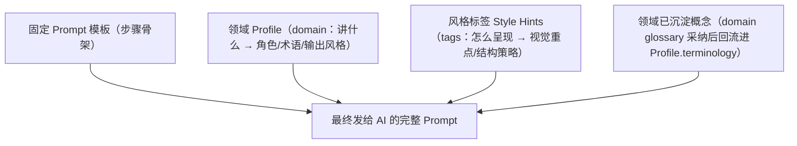
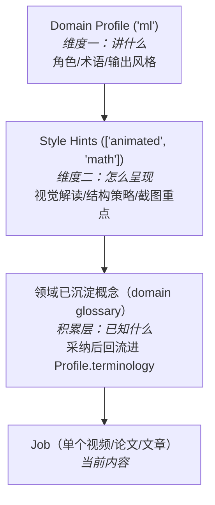
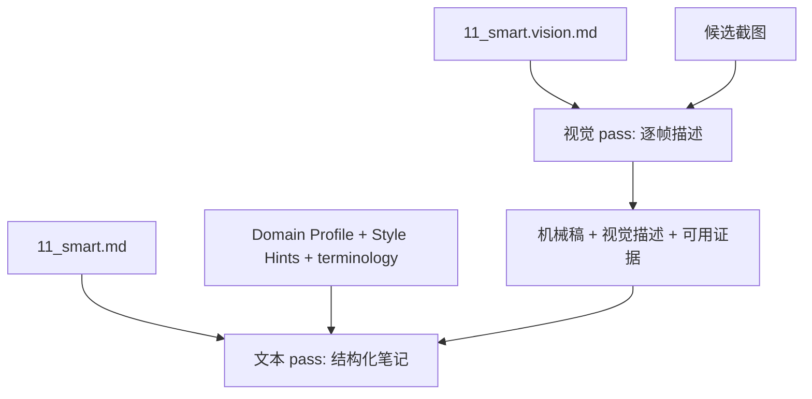

# 06 · Prompt 工程

> Prompt 模板 + 领域 Profile + 内容风格标签 + 概念沉淀。两个正交维度决定 Prompt：讲什么（Domain）× 怎么呈现（Style）。

## 1. 核心思路



### 两个正交维度

```
              Domain（讲什么）
              dl       ml    math    ...
Style      ┌────────┬───────┬───────┐
(怎么呈现)  │        │       │       │
animated   │ DL动画 │3B1B式 │ 数学  │  → 每帧有意义，描述动画变化
lecture    │ DL课   │ML课堂 │ 数学课│  → 关注板书PPT，忽略口水话
code-heavy │   —    │代码教程│   —   │  → 还原代码，按概念分块
talk       │ AI研讨 │AI峰会 │   —   │  → 正式结构，Q&A段
           └────────┴───────┴───────┘
```

Domain 决定术语和角色，Style 决定怎么解读视觉内容和组织结构。两者独立组合。

### 四层 Prompt 组装



三个输入维度 + 积累层：
- **模板**：步骤通用结构（"请重组为结构化笔记"），所有内容共享
- **Profile**：领域特有的角色、术语、输出风格（"你是技术文档编辑"），同 domain 共享
- **Style Hints**：内容形式特有的解读策略（"每帧动画变化都有意义"），按标签组合
- **沉淀概念**：领域 glossary 中采纳的术语会回流进 Profile.terminology（"Attention 已在本领域解释过"），故积累层最终也经 Profile 注入，按 **domain** 共享（非 collection）

## 2. 领域 Profile（M1 就需要）

不同类型视频的笔记质量高度依赖 Prompt 的领域适配。**M1 必须支持 Profile**。

### 配置文件

```yaml
# /data/prompts/profiles/deep-learning.yaml
domain: deep-learning
role: "深度学习领域编辑"
domain_context: "深度学习相关视频（模型架构、训练方法、推理优化、论文复现等）"

output_style:
  structure: "按'背景→方法→结果→结论'组织论文/方法类内容"
  terminology_handling: "首次出现的术语用'**术语**（解释）'格式"
  visual_focus: "损失曲线/架构图需要描述趋势与结构，不只读数字"

terminology:
  - "注意力: 让模型为不同输入位置分配权重的机制"
  - "微调: 在预训练模型上针对特定任务继续训练"
  - "蒸馏: 用大模型(教师)指导小模型(学生)训练，压缩模型"
  - "量化: 用低位宽表示权重/激活，降低显存与计算开销"
  - "过拟合: 模型在训练集表现好但泛化差"

do_not:
  - "不要给出无依据的性能结论"
  - "不要评价视频质量或UP主水平"
```

```yaml
# /data/prompts/profiles/programming.yaml
domain: programming
role: "技术文档编辑"
domain_context: "编程/AI/系统设计相关技术讲解视频"

output_style:
  structure: "按'概念→原理→实现→应用'组织"
  terminology_handling: "术语保留英文原文，括号附中文'Transformer（变换器）'"
  visual_focus: "代码截图需要尝试还原代码文本，架构图描述组件关系"
  code_blocks: "识别到代码时用 ``` 代码块格式"

terminology:
  - "Transformer: 基于自注意力机制的神经网络架构"
  - "Fine-tuning: 微调，在预训练模型上针对特定任务继续训练"
  - "LoRA: 低秩自适应，参数高效的微调方法"
  - "RAG: 检索增强生成，结合搜索和生成的方法"

do_not:
  - "不要简化技术细节"
  - "不要省略代码和公式"
```

```yaml
# /data/prompts/profiles/general.yaml (默认)
domain: general
role: "学习笔记编辑"
domain_context: "通用学习视频"

output_style:
  structure: "按视频自然章节组织"
  terminology_handling: "专业术语附简要解释"

terminology: []
```

### Profile 选择

Job 创建时指定 `domain`，Gateway 自动加载对应 Profile。如果不指定，系统根据内容自动推断（可选，M2）。

## 3. 风格标签 Style Hints（M1）

Domain Profile 管"讲什么"，Style Hints 管"怎么呈现"。同样是 ML 视频，3B1B 动画和课堂录制的笔记策略完全不同。

### 内置标签

```yaml
# /data/prompts/styles/animated.yaml
tag: animated
name: "动画讲解"
description: "3Blue1Brown 式可视化动画，每帧变化都有教学意义"
hints:
  - "每一帧的视觉变化都有教学意义，不要跳过任何动画过渡"
  - "重点描述'从A变换到B'的过程，而非静态结果"
  - "数学直觉和几何意义比公式推导更重要"
screenshot_focus: "描述动画变换过程（如矩阵旋转、向量移动），不只是最终画面"
```

```yaml
# /data/prompts/styles/lecture.yaml
tag: lecture
name: "课堂录制"
description: "教室/会议室录制的授课视频，有黑板/PPT/白板"
hints:
  - "关注板书和PPT上的内容，忽略讲师的口头填充词和重复"
  - "按教学逻辑组织笔记，而非严格按时间线"
  - "如果讲师纠正了之前的说法，以修正后的为准"
screenshot_focus: "提取板书/PPT 上的关键文字和图表"
```

```yaml
# /data/prompts/styles/code-tutorial.yaml
tag: code-tutorial
name: "代码教程"
description: "屏幕录制的编程教学，大量代码展示"
hints:
  - "截图中的代码必须尽量还原为代码块（使用 ```语言 格式）"
  - "按概念/功能分块组织，而非按编码顺序"
  - "保留完整的命令行操作和输出结果"
screenshot_focus: "优先还原代码文本，注意编辑器中的文件名和行号"
```

```yaml
# /data/prompts/styles/talk.yaml
tag: talk
name: "会议演讲"
description: "技术大会/学术会议的演讲录像"
hints:
  - "注意区分主讲人观点和提问者的问题"
  - "Q&A 部分单独整理"
  - "PPT 要点和口头补充内容对照记录"
screenshot_focus: "提取 PPT 要点，忽略会场环境"
```

```yaml
# /data/prompts/styles/case-study.yaml
tag: case-study
name: "案例分析"
description: "围绕具体案例展开的讲解（如系统设计案例、论文方法案例）"
hints:
  - "按'背景 → 过程 → 结果 → 结论'四阶段组织"
  - "时间线和因果关系是核心，保留关键时间点"
  - "案例涉及的模块/方法关系要理清"
screenshot_focus: "数据图表（损失曲线、指标表格等）重点描述趋势和关键数据点"
```

```yaml
# /data/prompts/styles/math-visual.yaml
tag: math-visual
name: "数学可视化"
description: "包含大量公式推导和几何图形"
hints:
  - "公式用 LaTeX 格式记录（$..$ 行内，$$...$$ 独立行）"
  - "推导过程的每一步都要保留，标注关键变换"
  - "几何图形描述空间关系和变换方向"
screenshot_focus: "公式截图必须完整还原为 LaTeX，图形描述坐标关系"
```

### 用户自定义标签

除内置标签外，用户可创建自定义标签：

```
POST /api/styles
{
  "tag": "my-podcast",
  "name": "播客访谈",
  "hints": ["区分主持人和嘉宾发言", "保留对话的问答结构"]
}
```

### 标签组合

投递时可选多个标签，hints 合并：

```
投递 URL + domain="ml" + style_tags=["lecture", "code-tutorial"]
  → ml Profile 的术语/角色
  + lecture 的"关注板书，按教学逻辑组织"
  + code-tutorial 的"还原代码用代码块"
```

前端投递页展示常用标签供勾选（可多选）：

```
┌──────────────────────────────────────┐
│ 内容风格（可多选）:                   │
│                                      │
│ [✓] 课堂录制    [ ] 动画讲解         │
│ [✓] 代码教程    [ ] 会议演讲         │
│ [ ] 案例分析    [ ] 数学可视化       │
│ [ ] + 自定义...                      │
└──────────────────────────────────────┘
```

## 4. 概念沉淀（领域 glossary → 回流 Profile）

知识沉淀挂在 **domain** 上（不是 collection），通过领域术语库（glossary）半自动积累，采纳后回流进 Profile.terminology。

### 喂养源：review 的 key_terms

每处理完一个内容，scheduler 优先读取 `concepts.json`；需要回退到 `review.json` 时，只接受 `schema_version=2` 且 `review_reliable=true` 的评审：

```
评审产出       去向
key_terms      → domain glossary（候选术语 status='suggested'，带候选定义 + 类型化 occurrence）
missing_concepts → 不入库，仅评审面板/查漏选题
top3_improvements → 仅评审面板，不自动改 Profile
```

`key_terms` 是这篇笔记**讲清楚**的概念（"讲清楚了什么"），故能给出候选定义；`missing_concepts` 是知识缺口，不作为沉淀来源。详见 [knowledge-store](04-module-design/knowledge-store.md) 与 [02-domain-model](02-domain-model.md)。

### 采纳与回流

用户在术语库审阅候选术语，采纳（accept）后：

1. glossary 中 `status: suggested -> accepted`
2. 同步**回流写入 `Profile.terminology`**（`sync_term_to_profile`），后续 AI 步骤即可用

```
POST /api/glossary/{domain}/{term}/accept   → 采纳 + 回流 Profile.terminology
POST /api/glossary                          → 手动新增（直接 accepted + 回流）
```

回流是**人工 gate** 的：只有采纳过的概念才进 Profile，避免噪声污染 Prompt。

### 沉淀的作用

术语表越丰富 → 智能笔记步命中已沉淀概念就沿用统一措辞,只对新概念做首次解释 → review 评分越高 → 评审又产出新 key_terms → 形成正反馈循环。

```
第 1 个内容: profile 几乎为空 → 笔记质量一般 → review 产出 5 个 key_terms 候选
第 5 个内容: 采纳后 profile 有 20 个术语 → 笔记质量明显提升、措辞一致
第 20 个内容: profile 有 80 个术语 → 笔记接近专业水平
```

## 5. Prompt 正文与组装

### 正文唯一真源

`configs/prompts/templates/*.md` 中的 15 份 tracked 文件是所有当前 AI 路由的正文唯一真源:

- 智能笔记:`04_smart_article`,`04_smart_podcast`,`05_smart_paper`,`11_smart`。
- 翻译与标点:`04_translate_article`,`04_translate_paper`,`04_translate_paper.pdf`,`08_punctuate.zh`,`08_punctuate.translate`。
- 概念、取证和评审:`05_concepts`,`10_evidence`,`05_review`,`06_review`,`12_review`。
- 视觉 pass:`11_smart.vision`。

Prompt API 和 Worker 执行使用同一解析契约。每次解析都从一份原始字节同时导出文本、SHA-256、来源、覆盖版本和路径；单次 API 响应复用该解析结果，单个 Worker 步骤实例缓存结果供幂等指纹、AI 审计和实际调用复用。API 与 Worker 是独立进程，不承诺跨请求共享内存快照；job override 由任务创建时固化的正文和版本保证执行可复现。

解析顺序是:

1. job 创建时固化在 `job.json.prompt_overrides[<runtime step>]` 的覆盖。
2. `/data/prompts/templates/<template>.md` 运行时热编辑文件。
3. `/app/configs/prompts/templates/<template>.md` 镜像内 tracked 文件。

只有 ENOENT 允许回退到下一层。高优先级文件存在但读取失败、权限拒绝、非 UTF-8 或内容为空时 fail-closed;三层均缺失时返回结构化的输入失败。步骤代码不保留第三份内联正文,`prompts/<step>.md` 也不是正文兜底层。

### 运行时身份与覆盖目标

pipeline 中的 `config.step.name` 是 done marker、progress、AI log、provider override 和 prompt override 的唯一运行时身份。`prompt_template` 只是正文模板映射,不改变步骤身份。video 概念步因此使用运行时名 `12_concepts`,同时映射到 `05_concepts` 正文。

`11_smart` 覆盖只替换主模板 `11_smart.md`,不作用于 `11_smart.vision.md`。`08_punctuate` 没有同名主模板,覆盖替换当次根据字幕语言实际加载的 `.zh` 或 `.translate` 变体。

### `11_smart` 的两段式 Prompt



视觉 pass 只产出帧描述清单。文本 pass 再组合主模板、Profile、Style Hints、已沉淀术语、机械稿、视觉描述和经验证的取证正文。已采纳并回流到 `Profile.terminology` 的概念会沿用统一措辞,只对未涵盖的新概念首次解释(见 §4)。

### 概念来源

四类概念步在 validate、input hash 和 execute 之间共用同一份来源快照:

- video 和 audio 只读最新版本化智能笔记。
- article 和 paper 按最新智能笔记 → `output/translated.md` → `intermediate/sections.json` 选择首个可用来源。
- 来源缺失、损坏、非 UTF-8、为空或 pipeline 类型未知时 fail-closed,不用另一来源在后续阶段悄然替换。

### 标点、评审与 AI tier

`08_punctuate` 和各内容类型 review 不使用领域 Profile。评审使用完整智能笔记和主来源,保存 `review_input.md` 与来源摘要;严格 JSON、1..5 整数分、完整输入、provider 正常结束及 citation 校验共同决定 `review_reliable`。提取抢救、截断、未知结束原因或伪 citation 只保留诊断,不向 glossary 喂 `key_terms`。

当前 16 个可执行 AI 路由声明 33 个有序 `primary/fallback/text_fallback` tier。tier 不按 provider/model 去重;相同配置的相邻 tier 仍保留独立尝试,因此调用次数、retry、usage、AI log 和请求 payload 都不变。

## 6. Profile 与 Style 管理

### API

```
GET  /api/profiles                    → 所有 Profile 列表
GET  /api/profiles/{domain}           → 单个 Profile
PUT  /api/profiles/{domain}           → 更新 Profile
POST /api/profiles/{domain}/terms     → 添加术语
DELETE /api/profiles/{domain}/terms/{term}  → 删除术语
```

### 前端 Profile 编辑页

```
┌────────────────────────────────────────────┐
│ ← Profile: deep-learning (DL)              │
├────────────────────────────────────────────┤
│                                            │
│  角色: [深度学习领域编辑        ]          │
│  背景: [深度学习相关视频...     ]          │
│                                            │
│  ── 输出风格 ──                            │
│  结构: [按'背景→方法→结果→结论']           │
│  术语: [首次出现用**术语**（解释）]        │
│  视觉: [损失曲线描述趋势形态    ]          │
│                                            │
│  ── 术语表 (128 个) ──                     │
│  [+ 添加术语]                              │
│  注意力: 让模型分配权重 [✎] [✕]            │
│  微调: 在预训练模型上继续训练 [✎] [✕]      │
│  蒸馏: 用大模型指导小模型 [✎] [✕]          │
│  ...                                       │
│                                            │
│  ── 候选术语 (待确认, 5 个) ──             │
│  [✓] 自注意力   [✓] 残差连接               │
│  [✕] 批归一化   [✓] 强化学习               │
│  [确认选中]                                │
│                                            │
└────────────────────────────────────────────┘
```

## 7. 与幂等的关系

步骤指纹使用 resolver 已固化的正文 SHA-256,不另行重读模板。job 覆盖、`/data` 热编辑或镜像 tracked 文件中实际命中的任何正文变化都会改变指纹。高优先级文件损坏时失败,不会通过回退到另一正文制造一个伪稳定指纹。

`11_smart` 的幂等输入至少包含机械稿、主模板快照、视觉模板快照、Domain Profile、排序后的 Style Hints、取证产物和 provider 覆盖。Profile 或 Style 变化后 resubmit,`11_smart` 及其下游 `12_concepts/12_review` 按 DAG 失效;采纳 glossary 候选并回流到 Profile 也会改变该指纹。

概念步指纹使用已解析来源快照的类型和 SHA-256。validate、input hash 和 execute 复用这份快照,避免在新智能笔记或译文并发写入时计算一份指纹却执行另一份正文。

## 8. 跨内容类型、跨来源共享

### 同 Domain 共享 Profile

```
domain: "ml" 的 Profile
  → Collection "LLM 学习" 下的 B站视频 → 11_smart 用它
  → Collection "LLM 学习" 下的 arXiv 论文 → 05_smart_paper 用它
  → Collection "CV 入门" 下的 YouTube 视频 → 11_smart 也用它
```

术语表和风格说明是领域级别的，不绑定内容类型和来源。

### 同 Domain 共享沉淀概念

```
domain "ml":
  处理 B站视频时评审产出 "Attention" "Query/Key/Value" 等 key_terms → 采纳进 ml glossary
    → 回流写入 ml Profile.terminology
    → 处理同 domain 下的 arXiv 论文（05_smart_paper）时，这些概念已在术语表中
    → AI 命中即沿用统一措辞、不再重复展开解释
```

**知识沉淀挂在 domain 上、跨内容类型与来源**：用户把所有 LLM 相关的视频、论文、文章归到同一 domain，它们贡献的概念在 glossary（带类型化 occurrences）中汇成一个整体，采纳后统一回流进该领域的 Profile。
